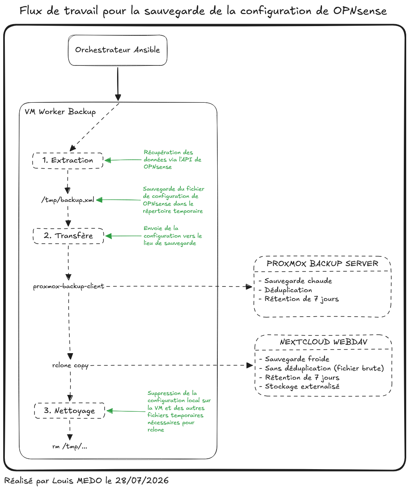

# {{ page.meta.title }}

!!! info "Informations"
    * **Date de création** : {{ page.meta.date }}
    * **Service ciblé** : {{ page.meta.service }}
    * **Auteur** : {{ page.meta.author }}
    * **Responsable** : {{ page.meta.owner }}

## 1. Objectifs de l'implémentation

L'architecture de sauvegarde de la configuration du pare-feu OPNsense pour l'infrastructure LoutikCLOUD répond aux impératifs suivants :

* **Découplage Stateful / Stateless** : Séparation de la configuration (le fichier XML) de l'appliance réseau. En cas de sinistre, une nouvelle instance OPNsense est déployée et la configuration est restaurée.
* **Principe KISS (Keep It Simple, Stupid)** : Centralisation des opérations de sauvegarde sur un nœud d'exécution (VM Worker Backup) qui interroge l'appliance via des requêtes HTTP standards (API REST), limitant les agents tiers sur le pare-feu.
* **Règle 3-2-1** : Double externalisation simultanée. Une sauvegarde chaude sur Proxmox Backup Server (On premise) et une sauvegarde froide sur Nextcloud WebDAV (Cloud).

## 2. Architecture

Le cycle de sauvegarde est piloté par un orchestrateur externe, qui déclenche les opérations sur une "VM Worker Backup" chargée de récupérer et de distribuer la configuration à l'aide de Ansible.

### 2.1. Topologie Logique

### 2.2. Mécanismes de fonctionnement

Le pipeline de traitement s'articule en trois phases strictes, conformément au flux de travail défini par le playbook Ansible :

1. **Extraction (API OPNsense)** : Utilisation du module `ansible.builtin.uri` pour effectuer une requête `GET` sur l'endpoint `/api/core/backup/download/this`. La configuration est extraite et sauvegardée localement sur le worker dans le fichier temporaire `/tmp/opn_backup/config.xml`.
2. **Transfert** : Double expédition de la donnée vers les points de stockage :
    * *Cible Chaude (Proxmox Backup Server)* : Exécution de `proxmox-backup-client backup`. Le client assure le hachage et la déduplication du fichier XML avant l'envoi vers le datastore.
    * *Cible Froide (Nextcloud WebDAV)* : Exécution de `rclone copy` en utilisant un fichier de configuration rclone généré dynamiquement. Le dossier contenant le fichier brut est transféré vers le stockage externalisé, avec un horodatage injecté dans le nom du dossier cible.
3. **Nettoyage** : Utilisation du module `ansible.builtin.file` pour purger de manière récursive le répertoire de travail `/tmp/opn_backup/` et le fichier de configuration éphémère `/tmp/rclone_opn.conf`, garantissant l'absence de résidus sensibles sur le worker.

## 3. Mécanismes de rétention

La politique de rétention est uniformisée à **7 jours** pour l'ensemble des cibles. La purge est orchestrée séquentiellement lors de l'exécution du playbook :

* **Proxmox Backup Server** : Application de la rétention via l'exécution de `proxmox-backup-client prune` avec l'argument `--keep-last 7` ciblant l'espace de noms dédié à OPNsense.
* **Nextcloud WebDAV** : Exécution de la commande `rclone delete --min-age 7d --rmdirs` pour supprimer les sauvegardes obsolètes et les dossiers vides associés via l'API WebDAV.

## 4. Gestion des secrets et Sécurité

L'architecture applique le principe du moindre privilège et du provisionnement éphémère pour protéger les accès au pare-feu et aux serveurs de sauvegarde.

* **Authentification API OPNsense** : L'accès à l'endpoint de sauvegarde s'effectue via un couple clé/secret API (`vault_opn_api_key`, `vault_opn_api_secret`) déchiffré à la volée par Ansible Vault.
* **Configuration Rclone Éphémère** : Le fichier `rclone.conf` nécessaire à l'authentification Nextcloud est généré dynamiquement à partir d'un template (`rclone.conf.j2`) avec des droits restreints (`0600`), puis détruit immédiatement en fin de pipeline.
* **Authentification PBS** : Le mot de passe de l'API PBS (`PBS_PASSWORD`) et l'empreinte du certificat (`PBS_FINGERPRINT`) sont injectés sous forme de variables d'environnement éphémères lors de l'appel des commandes `proxmox-backup-client`, sans jamais persister sur le disque du worker.