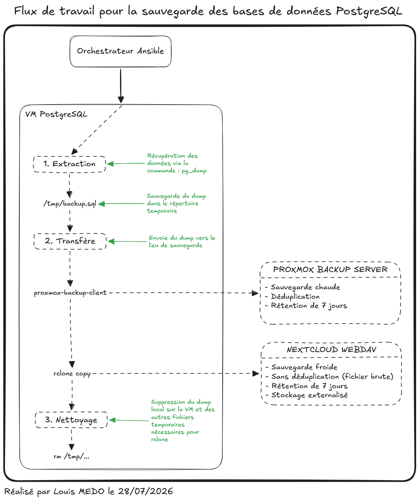

# {{ page.meta.title }}

!!! info "Informations"
    * **Date de création** : {{ page.meta.date }}
    * **Service ciblé** : {{ page.meta.service }}
    * **Auteur** : {{ page.meta.author }}
    * **Responsable** : {{ page.meta.owner }}

## 1. Objectifs de l'implémentation

L'architecture de sauvegarde de la base de données PostgreSQL pour l'infrastructure LoutikCLOUD répond aux impératifs suivants :

* **Découplage Stateful / Stateless** : Séparation de la donnée (le dump SQL) et du système d'exploitation. En cas de sinistre, la VM est reconstruite, seule la donnée est restaurée.
* **Principe KISS (Keep It Simple, Stupid)** : Exécution locale des tâches sur la VM cible. Réduction des dépendances externes et des points de défaillance réseau (absence de relais de type NFS).
* **Règle 3-2-1** : Double externalisation simultanée. Une sauvegarde chaude sur Proxmox Backup Server (On premise) et une sauvegarde froide sur Nextcloud WebDAV (Cloud).

## 2. Architecture

Le cycle de sauvegarde est piloté par un orchestrateur externe, qui déclenche les opérations directement sur la VM PostgreSQL de manière séquentielle à l'aide de l'outil Ansible.

### 2.1. Topologie Logique

### 2.2. Mécanismes de fonctionnement

Le pipeline de traitement s'articule en trois phases :

1. **Extraction** : Déclenchement de l'utilitaire natif `pg_dump`. Les données sont extraites et consolidées dans le fichier temporaire `/tmp/backup.sql`.
2. **Transfert** : Double expédition de la donnée vers les points de stockage :
    * *Cible Chaude (Proxmox Backup Server)* : Utilisation de `proxmox-backup-client`. Le client assure le découpage et la déduplication à la source avant l'envoi.
    * *Cible Froide (Nextcloud WebDAV)* : Utilisation de `rclone copy`. Le fichier brut est transféré sans déduplication vers le stockage externalisé.
3. **Nettoyage** : Exécution de la commande `rm` pour purger le dump local `/tmp/backup.sql` et les éventuels fichiers temporaires liés à rclone, prévenant ainsi la saturation de l'espace disque de la VM.

## 3. Mécanismes de rétention

La politique de rétention est uniformisée à **7 jours** pour l'ensemble des cibles. La purge est orchestrée directement par le pipeline Ansible :

* **Proxmox Backup Server** : Application de la rétention via la commande de pruning du client natif PBS.
* **Nextcloud WebDAV** : Exécution de la commande `rclone delete --min-age 7d` pour supprimer de manière déclarative les fichiers bruts obsolètes via l'API WebDAV.

## 4. Gestion des secrets et Sécurité

L'architecture applique le principe du moindre privilège. La compromission éventuelle de la VM PostgreSQL ne doit en aucun cas permettre la compromission des stockages de sauvegarde.

* **Authentification Nextcloud** : Utilisation d'un mot de passe d'application dédié à l'utilisateur de service de sauvegarde. Le secret est obfusqué localement via `rclone obscure`.
* **Authentification PBS** : Utilisation d'un jeton API (API Token) dont les permissions sont restreintes aux seuls droits d'ajout (append) et de purge sur le namespace de destination.
* **Provisionnement éphémère** : Les secrets critiques (tels que `PBS_PASSWORD`) sont injectés à la volée par Ansible sous forme de variables d'environnement. Aucun secret n'est stocké en clair de manière persistante sur le système de fichiers de la machine virtuelle.