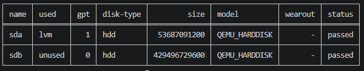
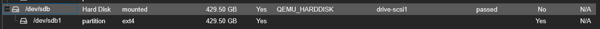
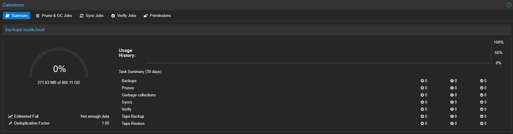

# {{ page.meta.title }}


!!! info "Informations"
    * **Date de création** : {{ page.meta.date }}
    * **Service ciblé** : {{ page.meta.service }}
    * **Auteur** : {{ page.meta.author }}
    * **Responsable** : {{ page.meta.owner }}

## 1. Contexte

Le composant à déployer est le Datastore principal de Proxmox Backup Server (version 4). Ce volume de stockage de 400 Go, provisionné sous forme de disque virtuel rattaché à la VM PBS, a pour rôle d'héberger les sauvegardes incrémentales, dédupliquées et compressées de l'ensemble des machines virtuelles de l'infrastructure LoutikCLOUD. Ce stockage local à la VM assure une séparation entre le système d'exploitation de PBS et la donnée de sauvegarde.

## 2. Prérequis

* Machine virtuelle Proxmox Backup Server (PBS v4) installée et fonctionnelle.
* Un disque virtuel secondaire de 400 Go (ex: `/dev/sdb`) rattaché à la VM (non formaté).
* Accès SSH avec privilèges `root` ou `sudo` sur la VM PBS.

## 3. Initialisation et formatage du disque

3.1. **Identifier le disque cible.** Utiliser la commande d'administration de PBS pour lister les disques vierges attachés à la VM.

  ```bash
  proxmox-backup-manager disk list
  ```

  ***Résultat attendu :***

  

3.2. **Créer le système de fichiers.** Initialiser le disque avec un système de fichiers `ext4`. Cette commande formate le disque et crée automatiquement une unité de montage `systemd`.

  ```bash
  proxmox-backup-manager disk fs create datastore --disk sdb --filesystem ext4
  ```

  * `datastore` : Nom logique attribué au montage local du système de fichiers.
  * `sdb` : Identifiant du disque récupéré à l'étape précédente (sans le préfixe `/dev/`).
  * `ext4` : Type de système de fichiers à appliquer (évite l'overhead de ZFS sur un disque virtuel).

  ***Résultat attendu :***

  

## 4. Configuration du datastore

4.1. **Créer le Datastore logique.** Associer le point de montage nouvellement créé à un Datastore PBS pour permettre la réception des sauvegardes.

  ```bash
  proxmox-backup-manager datastore create backups-loutikcloud /mnt/datastore/datastore
  ```

  * `backups-loutikcloud` : Nom du Datastore tel qu'il apparaîtra dans l'interface et dans la configuration PVE.
  * `/mnt/datastore/datastore` : Chemin absolu vers le point de montage généré automatiquement par l'étape 3.2.

  ***Résultat attendu :***

  