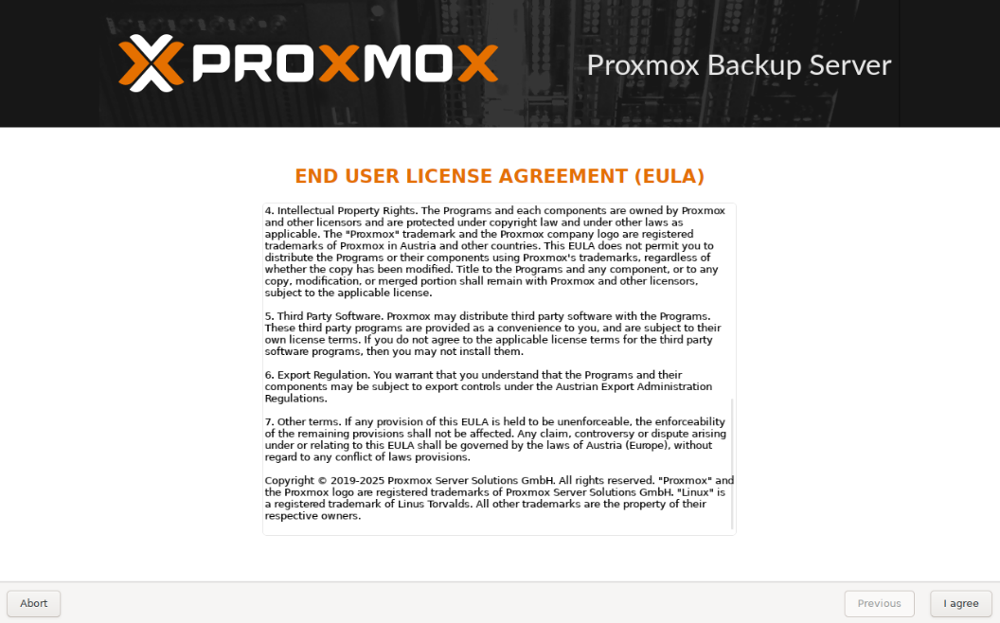
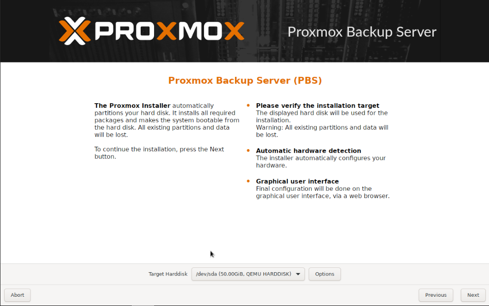
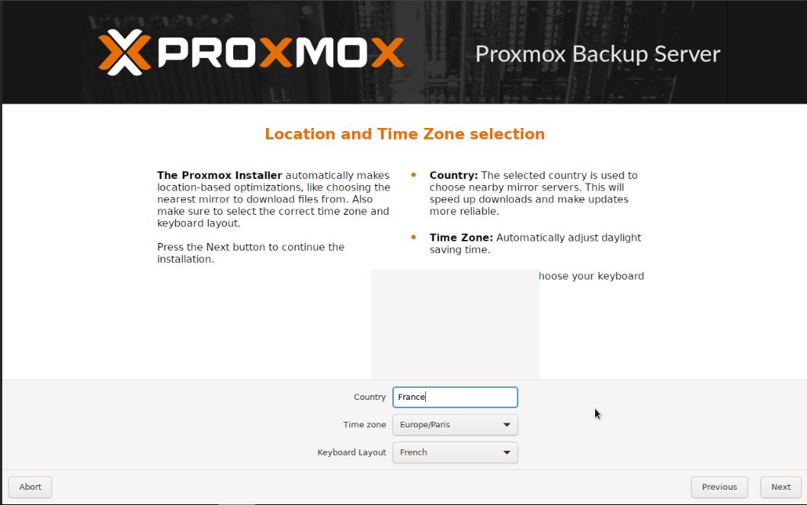
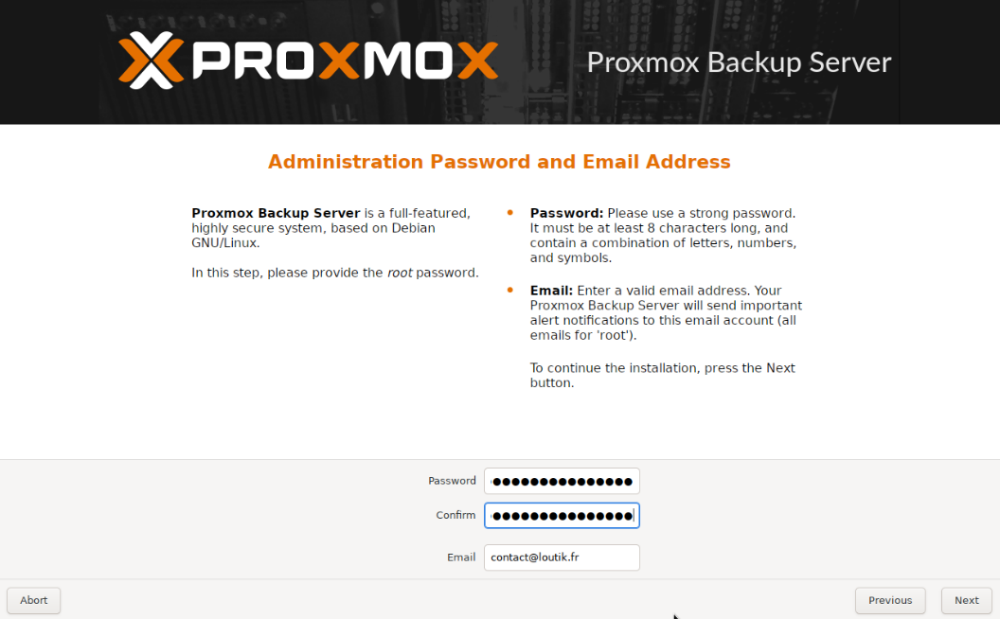
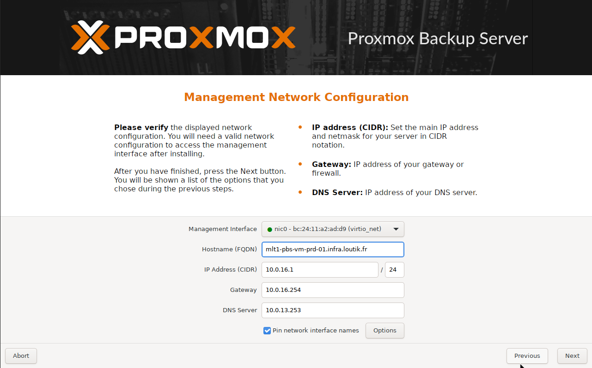
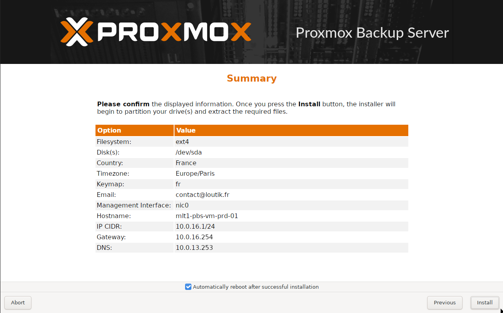

# {{ page.meta.title }}

!!! info "Informations"
    * **Date de mise à jour** : {{ page.meta.date }}
    * **Service ciblé** : {{ page.meta.service }}
    * **Auteur** : {{ page.meta.author }}
    * **Responsable** : {{ page.meta.owner }}

## 1. Contexte

Déploiement initial d'un serveur de sauvegarde Proxmox Backup Server (PBS) à partir de l'image ISO officielle. Cette procédure couvre l'installation étape par étape exclusivement via l'interface graphique de l'installeur pour initialiser l'appliance de sauvegarde. Elle est exécutée lors du provisionnement d'un nouveau nœud (physique ou virtuel) dédié à la rétention des données.

## 2. Prérequis

* Image ISO de Proxmox Backup Server téléchargée et amorcée sur le serveur cible.
* Disque dur vierge dédié à l'installation du système d'exploitation.
* Clavier et écran connectés (ou accès console via iDRAC/iLO/Proxmox VE).

## 3. Procédure d'exécution

1. **Acceptation de la licence (EULA).** Lire les termes du contrat de licence utilisateur final (EULA) généré par l'installeur Proxmox.

    

2. **Sélection du disque cible.** Sélectionner le disque de destination pour l'installation du système. Attention, l'installeur partitionne automatiquement le disque et toutes les données existantes seront perdues.

    

    - **`Target Harddisk`** : Choisir le disque approprié pour l'OS de PBS dans le menu déroulant, par exemple `/dev/sda`.

3. **Configuration de la localisation.** Définir les paramètres régionaux pour optimiser les miroirs de téléchargement et ajuster automatiquement l'heure du système.

    

    - **`Country`** : Saisir `France`.
    - **`Time zone`** : Sélectionner `Europe/Paris`.
    - **`Keyboard Layout`** : Sélectionner `French`.

4. **Définition des accès administrateur.** Configurer les informations d'identification pour le compte superutilisateur (`root`) du système basé sur Debian GNU/Linux.

    

    - **`Password` / `Confirm`** : Saisir et confirmer un mot de passe robuste.
    - **`Email`** : Renseigner une adresse valide (ex: `contact@loutik.fr`) pour recevoir les alertes de PBS.

5. **Configuration du réseau de management.** Renseigner les paramètres réseau statiques permettant l'accès et l'identification du serveur sur l'infrastructure.

    

    * **`Management Interface`** : Sélectionner la carte réseau à utiliser pour l'administration.
    * **`Hostname (FQDN)`** : Définir le nom d'hôte pleinement qualifié (ex: `mlt1-pbs-vm-prd-01.infra.loutik.fr`).
    * **`IP Address (CIDR)`** : Saisir l'adresse IP statique du serveur avec son masque de sous-réseau (ex: `10.0.16.1/24`).
    * **`Gateway` / `DNS Server`** : Indiquer l'adresse de la passerelle et du serveur DNS.

6. **Résumé et lancement de l'installation.** Vérifier le récapitulatif complet des paramètres configurés avant de valider l'écriture sur le disque.

    

    * **`Automatically reboot...`** : Conserver la case cochée pour redémarrer le serveur une fois la copie des fichiers terminée.
    * **`Install`** : Déclenche le formatage définitif du disque et l'installation du système d'exploitation.

## 4. Validation

À l'issue de l'installation et après le redémarrage automatique du serveur, vérifier que l'écran de la console affiche l'invite de connexion avec l'adresse IP d'accès à l'interface d'administration. Ouvrir un navigateur web, accéder à l'URL indiquée (généralement `https://<IP_DU_SERVEUR>:8007`), et confirmer que l'authentification avec l'utilisateur `root` et le mot de passe préalablement défini fonctionne correctement.

## 5. Rollback

L'installation via l'ISO formatant entièrement le disque cible, il n'y a pas de retour arrière système automatisé possible une fois l'installation lancée.

* En cas d'erreur de saisie pendant l'assistant : utiliser le bouton **Previous** pour corriger les valeurs, ou **Abort** pour annuler complètement le processus avant le formatage.
* Si l'installation a été finalisée sur le mauvais disque : restaurer les données d'origine depuis une sauvegarde externe si applicable, ou relancer l'ISO pour effectuer une nouvelle installation propre sur le bon volume.