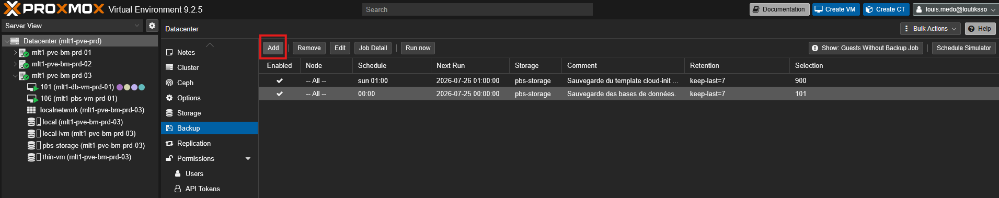
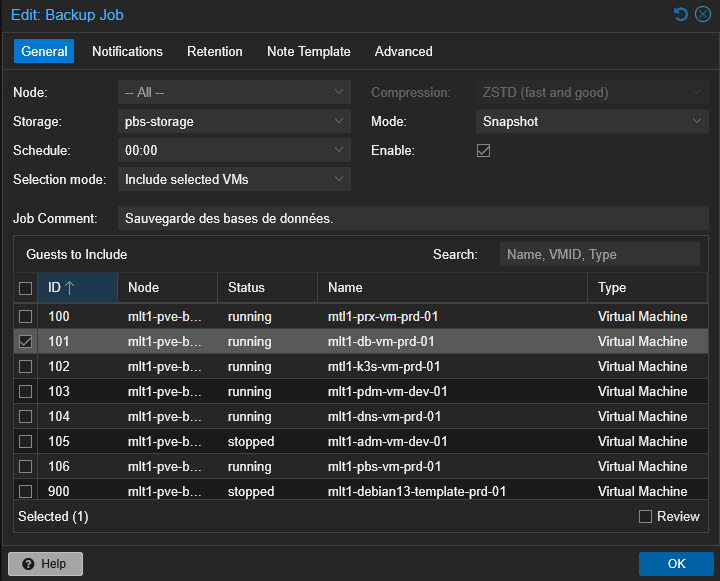
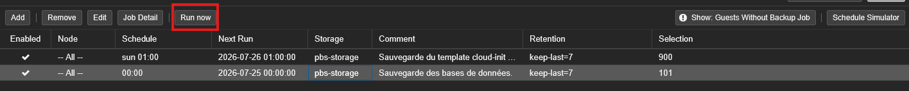

# {{ page.meta.title }}


!!! info "Informations"
    * **Date de mise à jour** : {{ page.meta.date }}
    * **Service ciblé** : {{ page.meta.service }}
    * **Auteur** : {{ page.meta.author }}
    * **Responsable** : {{ page.meta.owner }}

## 1. Contexte

Configuration d'une tâche de sauvegarde planifiée (Backup Job) au niveau du Datacenter Proxmox pour automatiser la sauvegarde des machines virtuelles vers le stockage Proxmox Backup Server (PBS). L'opération s'effectue principalement via l'interface graphique (GUI) pour les opérations quotidiennes.

## 2. Prérequis

* Accès à l'interface web Proxmox avec privilèges d'administration.
* Stockage "Proxmox Backup Server" préalablement configuré et authentifié (`pbs-storage`).
* Accès SSH au noeud Proxmox (optionnel, pour les commandes bonus).

## 3. Procédure d'exécution

1. **Accès au menu de planification des sauvegardes.** Dans l'arborescence de gauche de l'interface Proxmox, sélectionner **Datacenter**. Dans le menu central, cliquer sur **Backup**, puis sur le bouton **Add** en haut de la liste pour créer une nouvelle tâche.

    

    **Via CLI :**
 
    ```bash
    pvesh create /cluster/backup --store pbs-storage --vmid 101 --starttime 00:00 --mode snapshot
    ```

    - **`pvesh create /cluster/backup`** : Commande interagissant avec l'API Proxmox pour créer la tâche (`--store` définit la cible, `--starttime` la planification, `--mode snapshot` permet la sauvegarde à chaud).

2. **Configuration des paramètres de la tâche.** Dans la fenêtre "Edit: Backup Job" (onglet **General**), configurer les éléments graphiques suivants :
    - **Storage** : Choisir `pbs-storage` dans le menu déroulant.
    - **Schedule** : Définir l'heure d'exécution (ex: `00:00`).
    - **Selection mode** : Choisir `Include selected VMs` pour un ciblage précis.
    - **Mode** : Choisir `Snapshot` pour éviter l'arrêt de la VM pendant la sauvegarde.
    - **Guests to Include** : Cocher la case correspondant à la VM à sauvegarder (ex: ID `101`).
    - Cliquer sur le bouton **OK**.
 
    

## 4. Validation

1. Dans l'interface graphique (Datacenter > Backup), vérifier que la nouvelle tâche est listée avec une coche dans la colonne **Enabled**. 

2. Pour valider le fonctionnement, sélectionner la tâche et cliquer sur le bouton **Run now**. Une fenêtre de logs s'ouvrira ; vérifier que la dernière ligne indique `TASK OK`.
  
    

    **Via CLI :**

    ```bash
    vzdump 101 --storage pbs-storage --mode snapshot --compress zstd --node mlt1-pve-bm-prd-03
    ```

    * **`vzdump`** : Déclenche manuellement la sauvegarde de la VM 101 vers le stockage PBS avec une compression ZSTD.

## 5. Rollback

Dans l'interface graphique, aller dans **Datacenter** > **Backup**. Sélectionner la tâche de sauvegarde erronée et cliquer sur le bouton **Remove**, puis confirmer la suppression.

  **Via CLI :**

  ```bash
  pvesh delete /cluster/backup/backup-xxx
  ```

  * **`pvesh delete`** : Supprime l'entrée correspondante dans le planificateur via l'appel API (remplacer `backup-xxx` par l'ID de la tâche).