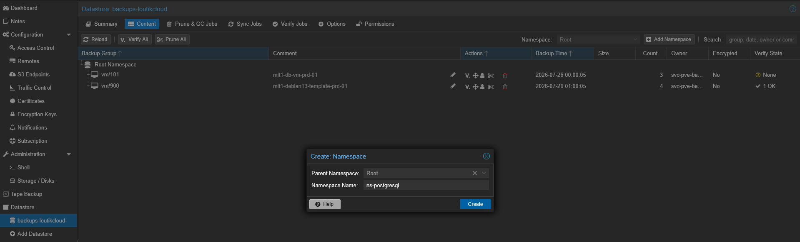
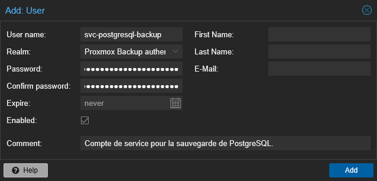
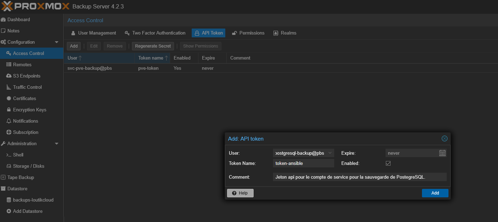
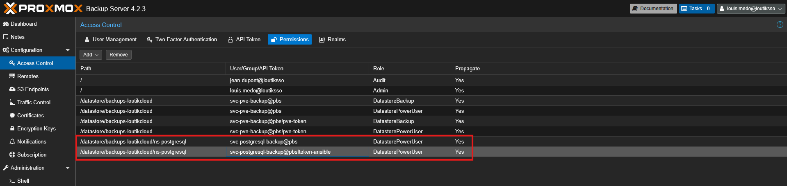

# {{ page.meta.title }}


!!! info "Informations"
    * **Date de mise à jour** : {{ page.meta.date }}
    * **Service ciblé** : {{ page.meta.service }}
    * **Auteur** : {{ page.meta.author }}
    * **Responsable** : {{ page.meta.owner }}

## 1. Contexte

Cette procédure vise à provisionner un environnement de sauvegarde sécurisé et isolé sur Proxmox Backup Server (PBS) pour l'intégration d'un nouveau service (ex: PostgreSQL, OPNsense). L'objectif est de garantir le cloisonnement des données via un Namespace dédié et l'application du principe de moindre privilège via un jeton API restreint.

## 2. Prérequis

* Accès administrateur (`root@pam` ou équivalent `Admin`) à l'interface graphique Web de Proxmox Backup Server.
* Connaissance du nom du Datastore cible (ex: `backups-loutikcloud`).
* Identification du service à sauvegarder pour nommer les ressources selon la convention LoutikCLOUD (ex: `ns-[service]`, `svc-[service]-backup`).

## 3. Procédure d'exécution

1. **Création du namespace :**

    Depuis l'interface d'administration PBS, accédez au menu principal de gauche. Dans le menu **Datastore** cliquer sur `backups-loutikcloud`. Puis Naviguez ensuite dans l'onglet **Content** et cliquez sur le bouton **Add Namespace**. Renseignez le nom sous la forme `ns-[service]` (ex: `ns-postgresql`) et validez.

    

2. **Création de l'utilisateur de service** :

    Dans le menu de gauche, rendez-vous sous **Configuration** puis **Access Control**. Sélectionnez l'onglet **User Management** et cliquez sur **Add**. Renseignez le nom d'utilisateur sous la forme `svc-[service]-backup` (ex: `svc-postgresql-backup`). Laissez le *Realm* sur `Proxmox Backup (pbs)`. Générez un mot de passe fort via le gestionaire de mot de passe. Cliquez sur **Add**.

    

3. **Génération du Jeton API** :

    Toujours dans **Configuration > Access Control**, basculez sur l'onglet **API Tokens** et cliquez sur **Add**. Sélectionnez l'utilisateur créé à l'étape précédente dans le menu déroulant **User**. Dans le champ **Token ID**, nommez le jeton (ex: `token-ansible`). Cliquez sur **Add**. **Attention : Copiez immédiatement la valeur du champ "Secret"** qui s'affiche à l'écran, elle ne sera plus jamais visible.

    

4. **Attribution des permissions** :

    Basculez sur l'onglet **Permissions** et cliquez sur le bouton **Add**, puis choisissez **API Token Permission**. Configurez les champs suivants : 

    - **Path** : Déroulez l'arborescence et sélectionnez le chemin exact du namespace, soit `/datastore/[nom_datastore]/ns-[service]`.
    - **API Token** : Sélectionnez le jeton généré à l'étape 3 (`svc-[service]-backup@pbs!token-ansible`).
    - **Role** : Sélectionnez `DatastorePowerUser`. 
    Validez en cliquant sur **Add**. 
    Répétez cette opération exacte une seconde fois en attribuant cette fois-ci pour `User Permission` au même chemin et avec les mêmes droits.

    

## 4. Validation

Pour valider l'opération, vérifiez que l'interface affiche correctement le rôle assigné exclusivement au *Path* du namespace pour ce jeton. Depuis une machine distante, exécutez la commande d'interrogation suivante en définissant au préalable la variable d'environnement avec la valeur du "Secret" récupéré à l'étape 3 :

```bash
export PBS_PASSWORD="[SECRET_DU_TOKEN]"
proxmox-backup-client version --repository 'svc-[service]-backup@pbs!token-ansible@[IP_DU_PBS]:[NOM_DATASTORE]'
```

La commande doit retourner la version du client et du serveur sans erreur 401 (Unauthorized) ni 403 (Forbidden).