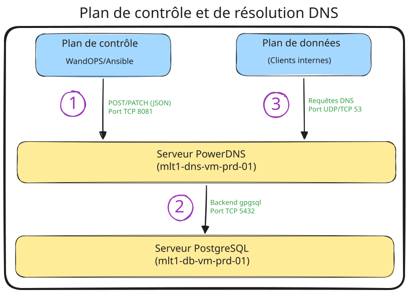
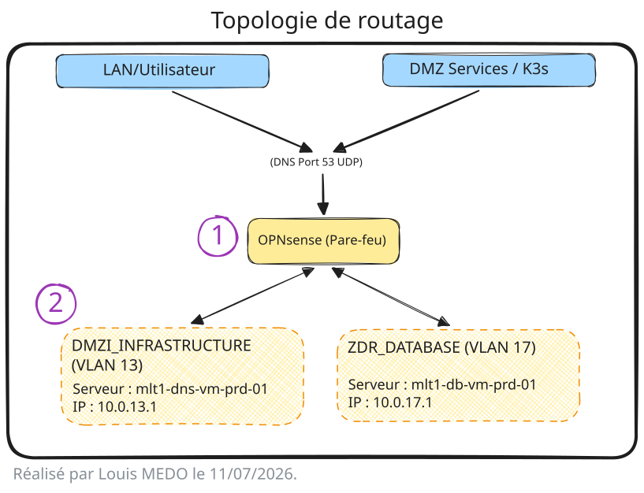

# {{ page.meta.title }}

!!! info "Informations"
    * **Date de création** : {{ page.meta.date }}
    * **Service ciblé** : {{ page.meta.service }}
    * **Auteur** : {{ page.meta.author }}
    * **Responsable** : {{ page.meta.owner }}

## 1. Objectifs de l'implémentation

L'intégration de PowerDNS au sein de l'infrastructure LoutikCLOUD vise à fournir un service de résolution DNS autoritaire et interne. Les objectifs principaux sont :

* **Automatisation (IaC)** : Gestion des zones (SOA) et des enregistrements exclusivement via l'API REST pour garantir l'indépendance de la configuration (Stateless).
* **Résilience** : Abandon des fichiers de zones plats au profit d'un backend natif PostgreSQL, permettant une réplication SQL robuste et centralisée.

## 2. Architecture

L'architecture repose sur la séparation entre le plan de configuration (via l'API REST) et le plan de résolution DNS (requêtes UDP/TCP).

### 2.1. Topologie Logique

**Fonctionnement :**

1. **Configuration (API)** : WandOps (via Ansible) interroge et modifie l'état des zones DNS en s'authentifiant auprès du serveur web interne de PowerDNS avec une clé API statique.
2. **Stockage (Backend)** : PowerDNS traduit ces requêtes API en requêtes SQL et les stocke dans la base de données PostgreSQL isolée.
3. **Résolution (DNS)** : Les clients de l'infrastructure interrogent le port 53. PowerDNS lit les enregistrements en temps réel depuis la base de données pour fournir une réponse autoritaire.

### 2.2. Mécanismes de communication

* **Le Serveur Web / API** : Activé via `webserver=yes` et `api=yes`. Il écoute sur l'IP locale (10.0.13.1) et est restreint par des ACL réseaux (directive `webserver-allow-from`).
* **Le Backend gpgsql** : PowerDNS agit comme un client SQL standard. La configuration DNSSEC est gérée nativement par le backend (`gpgsql-dnssec=yes`).
* **La Réplication (Native)** : Le paramètre `kind: "Native"` est appliqué à chaque zone créée via l'API, déléguant la réplication multi-nœuds aux mécanismes inhérents de PostgreSQL.

## 3. Intégration physique

Le service DNS est déployé selon le modèle DMZ multi-zones de LoutikCLOUD, isolant le service de résolution (DMZ Infrastructure) de son stockage d'état (ZDS).

### 3.1. Topologie de routage

1. **Filtrage** : L'OPNsense autorise uniquement le trafic UDP/TCP 53 depuis les VLANs internes vers l'IP `10.0.13.1`. Les accès à l'API (Port 8081) sont restreints au VLAN de déploiement (CI/CD / Ansible).
2. **Isolation de la donnée** : Le serveur PowerDNS n'héberge aucune donnée locale. Il accède à la Zone de Diffusion Restreinte (ZDR) via un flux spécifique autorisé par l'OPNsense.

## 4. Gestion des secrets

L'infrastructure applique le principe du moindre privilège, tant au niveau du système que de la base de données.

**Identités Système (OS)** : 

  * Le processus PowerDNS s'exécute avec les privilèges restreints de l'utilisateur et du groupe système `pdns` (directives `setuid` et `setgid`).

**Identités Base de données (PostgreSQL RBAC)** :

  * Révocation stricte des droits `PUBLIC` sur la base de données `db_powerdns`.
  * Création d'un rôle d'administration `role_adm_powerdns` (réservé aux DBA, ex: louismedo).
  * Création d'un utilisateur applicatif `usr_powerdns`, dédié au daemon, disposant uniquement des droits `SELECT`, `INSERT`, `UPDATE`, `DELETE` sur les tables requises.

**Gestion des Secrets (Ansible Vault)** :

  * Les mots de passe de la base de données (`vault_pdns_db_password`) et la clé API (`vault_pdns_api_key`) sont chiffrés et injectés dynamiquement lors du déploiement.