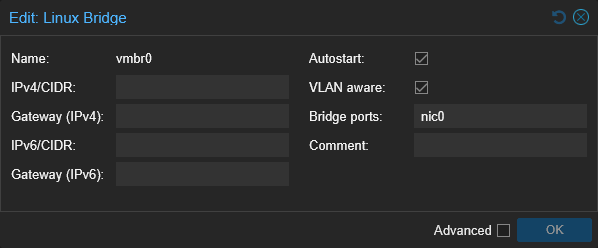
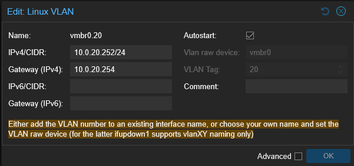

# {{ page.meta.title }}


!!! info "Informations"
    * **Date de création** : {{ page.meta.date }}
    * **Service ciblé** : {{ page.meta.service }}
    * **Auteur** : {{ page.meta.author }}
    * **Responsable** : {{ page.meta.owner }}

## 1. Contexte
Cette procédure décrit la modification de la configuration réseau post-installation d'un nœud hyperviseur Proxmox VE au sein de l'infrastructure LoutikCLOUD. L'objectif est de segmenter le trafic en activant le support 802.1Q (VLAN aware) sur le commutateur virtuel par défaut, et d'isoler l'interface de management sur un VLAN dédié (VLAN 20 - ADMOOB). Cette topologie sécurise l'accès à l'hyperviseur tout en permettant aux futures machines virtuelles d'être affectées à différentes zones réseau (ex: DMZ, LAN) via un port unique.

## 2. Prérequis

* Hôte Proxmox VE installé avec un accès administrateur actif via l'interface graphique (GUI).
* Plan d'adressage IP défini pour la zone d'administration (VLAN 20).
* Accès à l'équipement réseau (switch physique) connecté à l'interface de l'hôte.

## 3. Configuration réseau via l'interface graphique

3.1. **Modification du Bridge par défaut (vmbr0).** Dans le menu de gauche, naviguez vers `[Nom_du_nœud] > System > Network`. Sélectionnez l'interface `vmbr0` et cliquez sur `Edit`. Retirez la configuration IP existante et activez le mode VLAN. **Veiller à ce que `Bridge ports` possède la valeur `nic0`**.

  ```text
  Action GUI : Édition des propriétés de vmbr0
  ```

  

  `VLAN aware` : Option (à cocher) permettant au commutateur virtuel d'accepter et de distribuer les trames taguées (802.1Q) vers les machines virtuelles sans nécessiter la création d'interfaces bridge multiples.

  `IPv4/CIDR & Gateway` : Champs (à vider) pour supprimer l'adresse IP et la passerelle non taguées, désactivant ainsi le management sur le réseau natif.

3.2. **Création du Linux VLAN d'administration.** Toujours dans la section `Network`, cliquez sur `Create` puis sélectionnez `Linux VLAN`. Configurez la nouvelle interface de management.

  ```text
  Action GUI : Création d'une interface de type Linux VLAN
  ```

  

  `Name` : Identifiant de l'interface (ex: `vmbr0.20`). Cette nomenclature stricte lie automatiquement l'interface virtuelle au pont `vmbr0` avec le tag VLAN `20`.

  `IPv4/CIDR` : Adresse IP d'administration et son masque de sous-réseau (ex: `10.0.20.252/24`).

3.3. **Application de la nouvelle topologie réseau.** Une fois les modifications préparées (visibles en attente de validation), appliquez la configuration pour la rendre opérationnelle.

  ```text
  Action GUI : Clic sur le bouton "Apply Configuration"
  ```

  `Apply Configuration` : Commande d'exécution qui déclenche le rechargement du service réseau (via `ifupdown2`). Elle applique les nouveaux paramètres de port trunk et d'adressage virtuel sans nécessiter un redémarrage complet du serveur.

!!! warning "Configuration du Switch"
    Après avoir appliqué la configuration sur Proxmox, vous devez faire passer l'interface du mode `access` au mode `trunk` sur le commutateur.