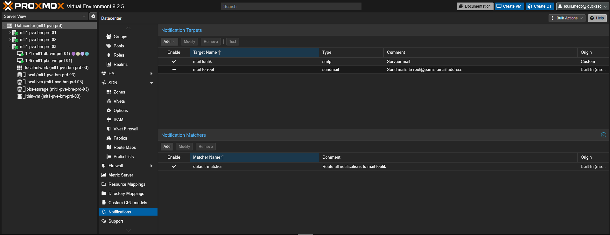
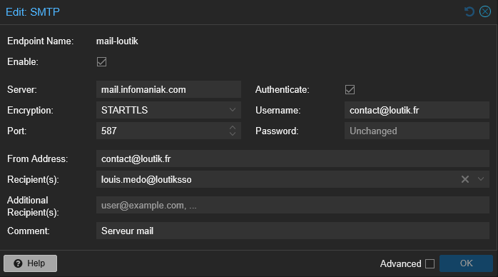
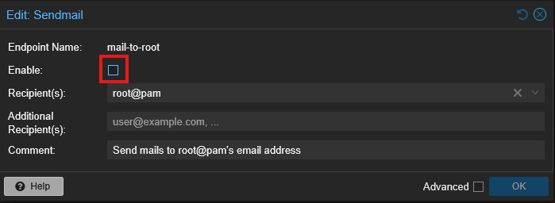
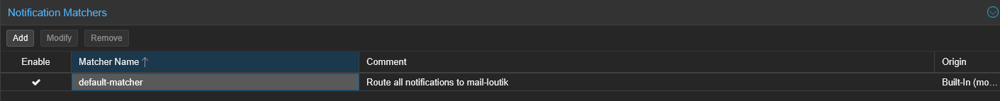
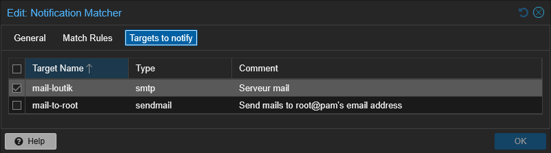

# {{ page.meta.title }}

!!! info "Informations"
    * **Date de mise à jour** : {{ page.meta.date }}
    * **Service ciblé** : {{ page.meta.service }}
    * **Auteur** : {{ page.meta.author }}
    * **Responsable** : {{ page.meta.owner }}

## 1. Contexte

Configuration d'un relai SMTP externe (Infomaniak) au niveau du cluster Proxmox pour centraliser et fiabiliser l'envoi des notifications systèmes et d'alerting vers l'adresse de contact principale. Cette configuration remplace le système `sendmail` local par défaut.

## 2. Prérequis

* Accès administrateur à l'interface web Proxmox.
* Identifiants du compte mail stockés dans le coffre-fort Bitwarden (Projet : Services - Mail - contact@loutik.fr).
* Accès au pare-feu OPNsense (`opn1.infra.loutik.fr`) pour l'ouverture des flux.

!!! warning "Règle de pare-feu requise"
    Pensez à autoriser explicitement le flux réseau sortant vers les serveurs mail d'Infomaniak (`mail.infomaniak.com` sur le port TCP `587`) depuis les interfaces de management Proxmox sur le pare-feu [OPNsense](https://opn1.infra.loutik.fr).

## 3. Procédure d'exécution

1. **Accès au menu des notifications.** Dans l'arborescence de l'interface Proxmox, sélectionner **Datacenter**, puis accéder au sous-menu **Notifications** (ou utiliser la vue globale Datacenter).

    

2. **Création du Notification Target (SMTP)** :

    Dans la section *Notification Targets*, cliquer sur **Add** puis sélectionner **SMTP**. Renseigner les paramètres de connexion au serveur Infomaniak en récupérant le mot de passe dans Bitwarden.

    

3. **Désactivation de la cible locale** :

    Toujours dans *Notification Targets*, sélectionner la ligne `mail-to-root` (type sendmail), cliquer sur **Modify**, décocher la case **Enable** puis valider.

    

4. **Modification du Notification Matcher** :

    Dans la section *Notification Matchers*, sélectionner `default-matcher` et cliquer sur **Modify**.

    

    Dans l'onglet **Targets to notify**, décocher l'ancienne cible `mail-to-root` et cocher la nouvelle cible `mail-loutik`. Valider en cliquant sur **OK**.

    

## 4. Validation

Dans l'interface Proxmox, section *Notification Targets*, sélectionner la cible `mail-loutik` et cliquer sur le bouton **Test**.
Vérifier la réception effective de l'e-mail de test dans la boîte de réception `contact@loutik.fr`. En cas d'échec, vérifier les journaux de blocage (Live View) sur le pare-feu OPNsense.