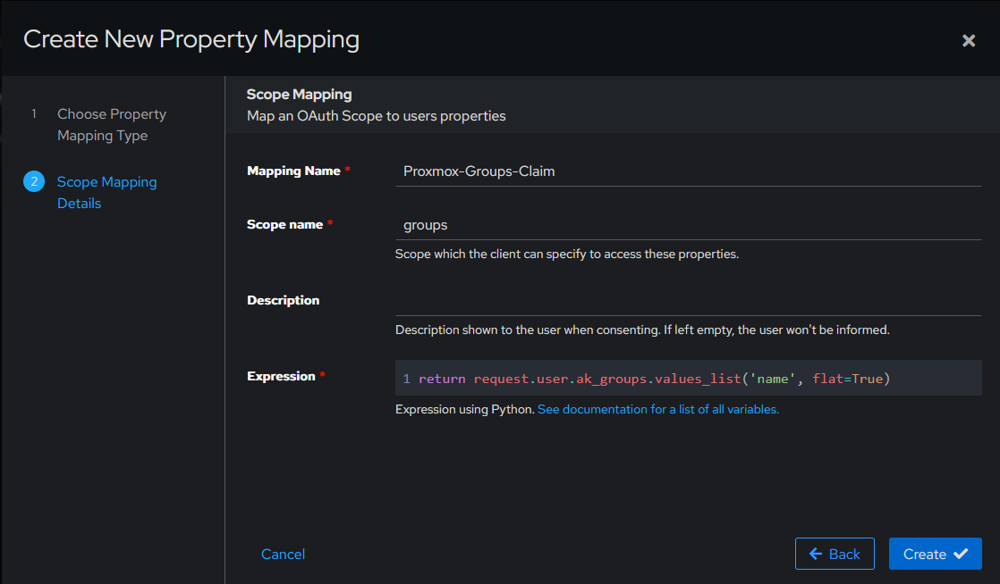
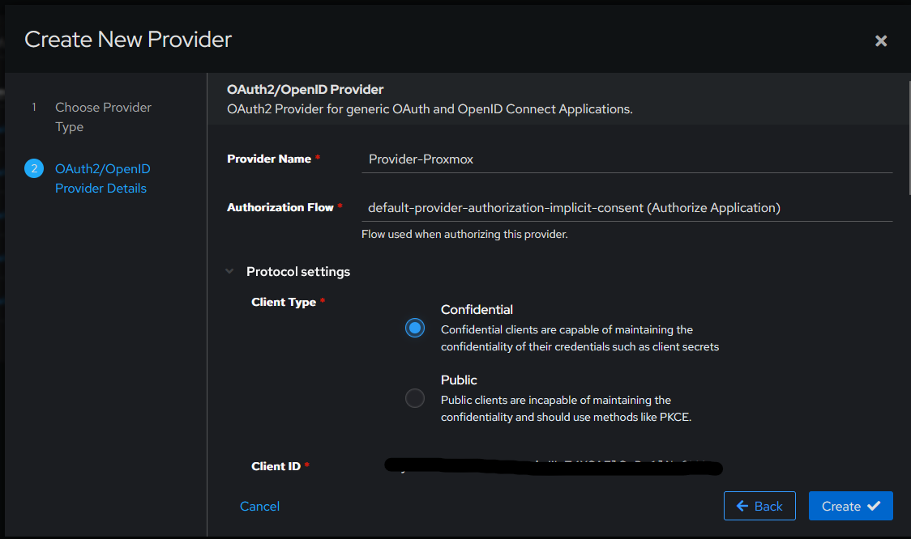
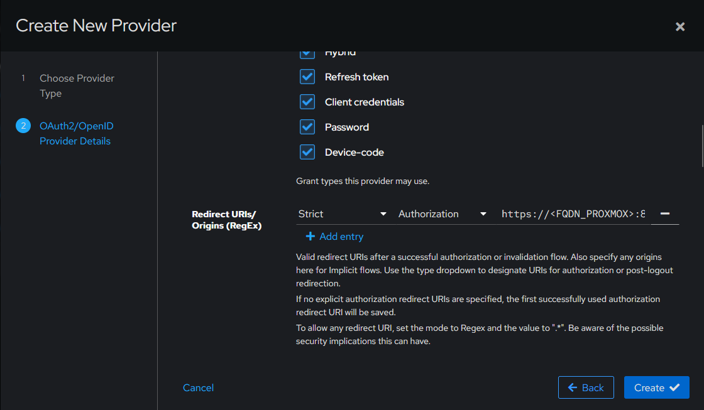
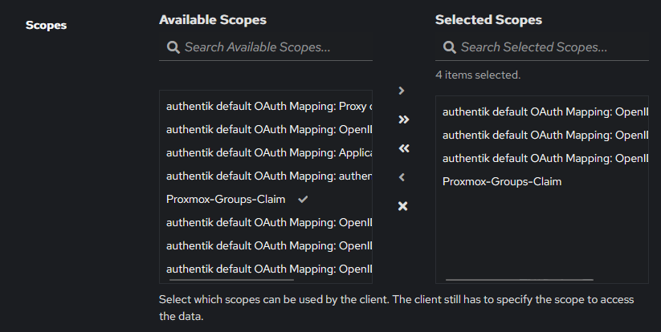
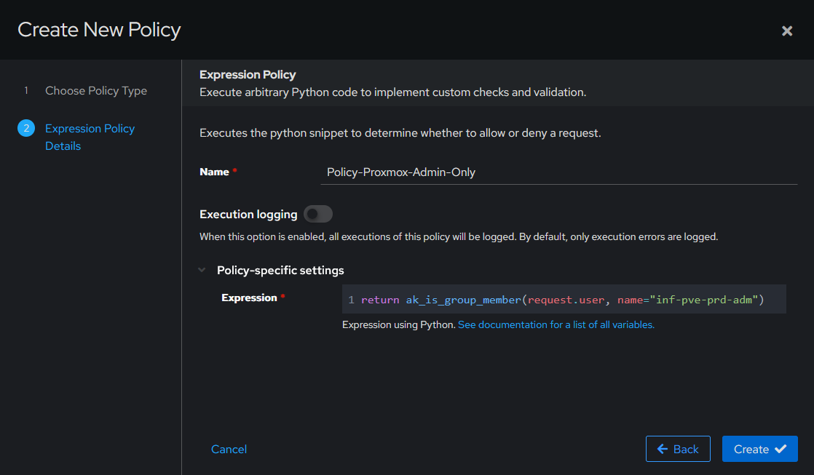
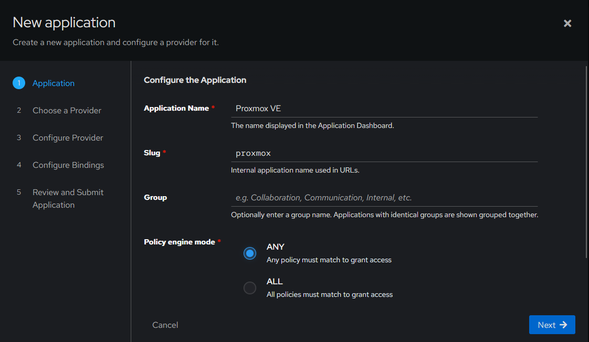
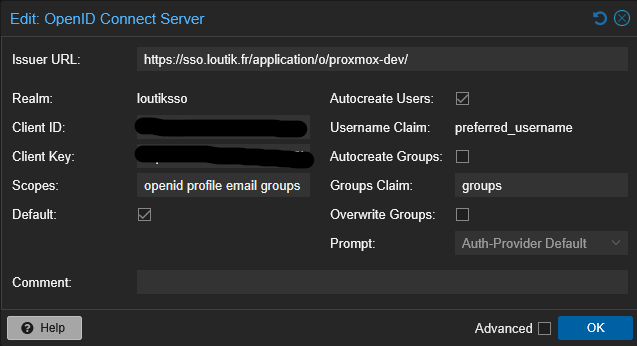
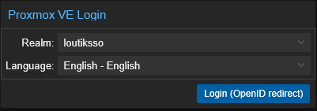

# {{ page.meta.title }}


!!! info "Informations"
    * **Date de création** : {{ page.meta.date }}
    * **Service ciblé** : {{ page.meta.service }}
    * **Auteur** : {{ page.meta.author }}
    * **Responsable** : {{ page.meta.owner }}

## 1. Architecture et contexte
Ce document décrit la procédure d'intégration SSO (OIDC) entre Authentik (v.2026.5.0) et Proxmox VE. L'objectif est de déléguer l'authentification et l'autorisation à Authentik. L'accès est strictement restreint aux utilisateurs membres du groupe `inf-pve-prd-adm`. Proxmox est configuré pour associer automatiquement ce groupe au rôle Administrateur via les claims OIDC, garantissant une gestion des accès centralisée et sécurisée au sein de l'infrastructure LoutikCLOUD.

## 2. Prérequis

* **Réseau** : Enregistrements DNS configurés pour les FQDN d'Authentik et de Proxmox. Flux HTTPS (443) et API Proxmox (8006) ouverts.
* **Dépendances** : Instance Authentik 2026.5.0 opérationnelle. Nœud ou cluster Proxmox VE opérationnel.
* **Gestion des accès et secrets** : Les valeurs générées lors de cette procédure (`Client ID` et `Client Secret`) devront être stockées de manière sécurisée (ex: Vault) si intégrées ultérieurement dans des modules IaC (Ansible/Terraform).

## 3. Configuration du Fournisseur Authentik

1. **Création du Scope Mapping.** Dans Authentik, naviguez vers *Customization > Property Mappings* et créez un *OIDC Scope Mapping* pour exposer les groupes de l'utilisateur.

    

    ```python
    return request.user.ak_groups.values_list('name', flat=True)
    ```

    * `Name` : Proxmox-Groups-Claim
    * `Scope name` : groups

2.  **Création du Provider.** Naviguez vers *Applications > Providers* et créez un *OAuth2/OpenID Provider*.

    
    
    

    * `Name` : Provider-Proxmox
    * `Authorization Flow` : default-provider-authorization-implicit-consent (Authorize Application)
    * `Client Type` : Confidential
    * `Scopes` : Sélectionner openid, email, profile, et le nouveau scope groups.
    * `Redirect URIs` : https://<FQDN_PROXMOX>:8006

## 4. Configuration de l'Application Authentik et Restriction

1.  **Création de la Policy d'accès.** Naviguez vers *Customization > Policies* et créez une *Expression Policy* pour bloquer l'accès aux utilisateurs non autorisés.

    

    ```python
    return ak_is_group_member(request.user, name="inf-pve-prd-adm")
    ```

    * `Name` : Policy-Proxmox-Admin-Only

2.  **Création et liaison de l'Application.** Naviguez vers *Applications > Applications*, créez l'application, associez-lui le Provider. Dans l'onglet *Policy / Group / User Bindings* de l'application, liez la Policy créée précédemment.

    

    * `Name` : Proxmox VE
    * `Slug` : proxmox

## 5. Configuration du Rôle et du Realm sur Proxmox

1.  **Préparation du groupe local et des ACL.** Connectez-vous en shell sur le serveur Proxmox pour créer le groupe correspondant et lui attribuer les droits Administrateur globaux.

    ```bash
    pveum group add inf-pve-prd-adm
    pveum acl modify / -group inf-pve-prd-adm -role Administrator
    ```

    * `inf-pve-prd-adm` : Nom du groupe cible, devant correspondre exactement à la valeur transmise par le claim Authentik.
    * `Administrator` : Rôle natif Proxmox accordant les privilèges d'administration.

2.  **Ajout du Realm OIDC.** Dans l'interface web Proxmox, naviguez vers *Datacenter > Permissions > Realms* et ajoutez une méthode *OpenID Connect*.

    

    * `Issuer URL` : https://<FQDN_AUTHENTIK>/application/o/proxmox/
    * `Client ID / Client Key` : Renseigner les secrets générés par le Provider Authentik.
    * `Username Claim` : preferred_username
    * `Default` : coché
    * `Scopes` : openid profile email groups
    * `Autocreate Users` : Coché (permet le provisionnement JIT de l'utilisateur dans Proxmox).

## 6. Validation post-déploiement

1.  **Tests de connexion.** Valider l'intégration selon la matrice d'autorisation configurée.

    

    * `Cas nominal` : Connexion avec un utilisateur du groupe `inf-pve-prd-adm`. Résultat attendu : succès, accès total (Administrator).
    * `Cas de rejet` : Connexion avec un utilisateur valide mais n'appartenant pas au groupe `inf-pve-prd-adm`. Résultat attendu : blocage par la Policy Authentik ("Access denied").

## Annexe

- [Documentation officielle Authentik - OIDC Provider](https://docs.goauthentik.io/docs/providers/oauth2/)
- [Documentation officielle Proxmox VE - User Management & OIDC](https://pve.proxmox.com/pve-docs/pve-admin-guide.html#pveum_authentication_realms)