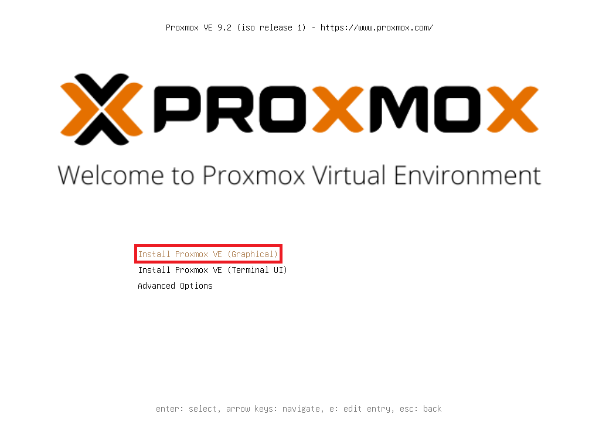
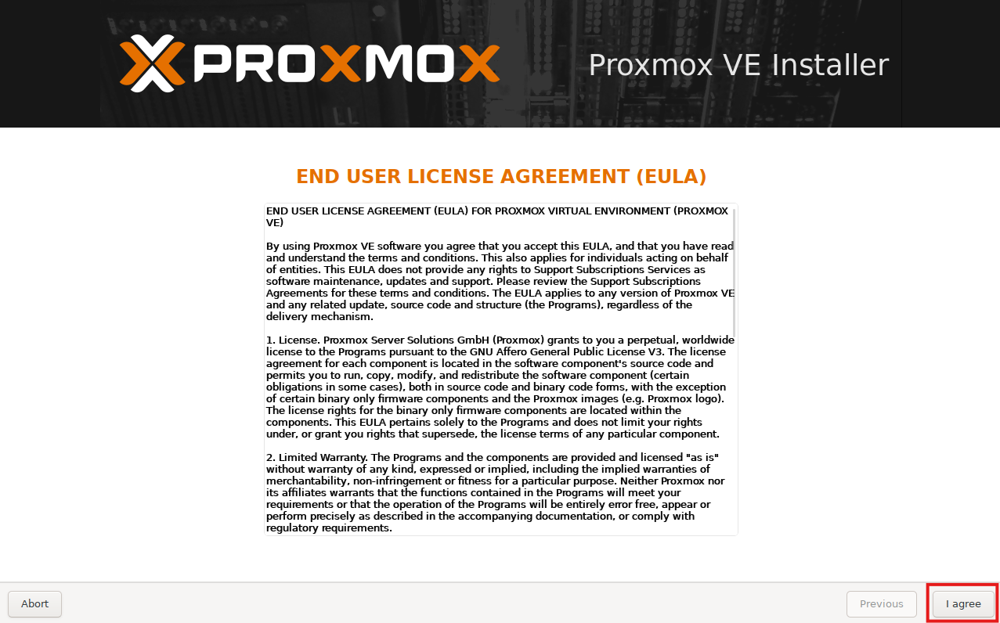
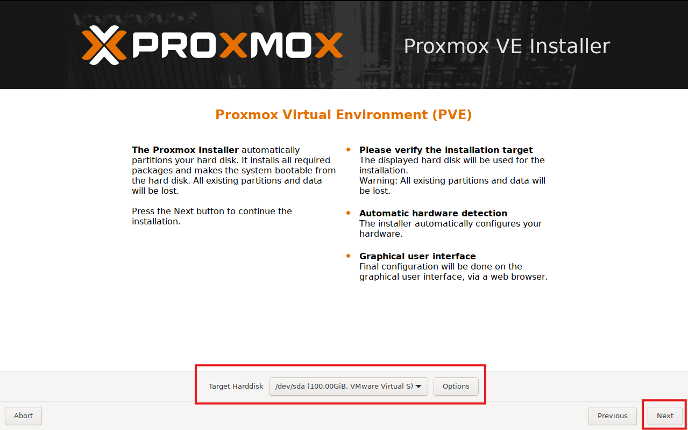
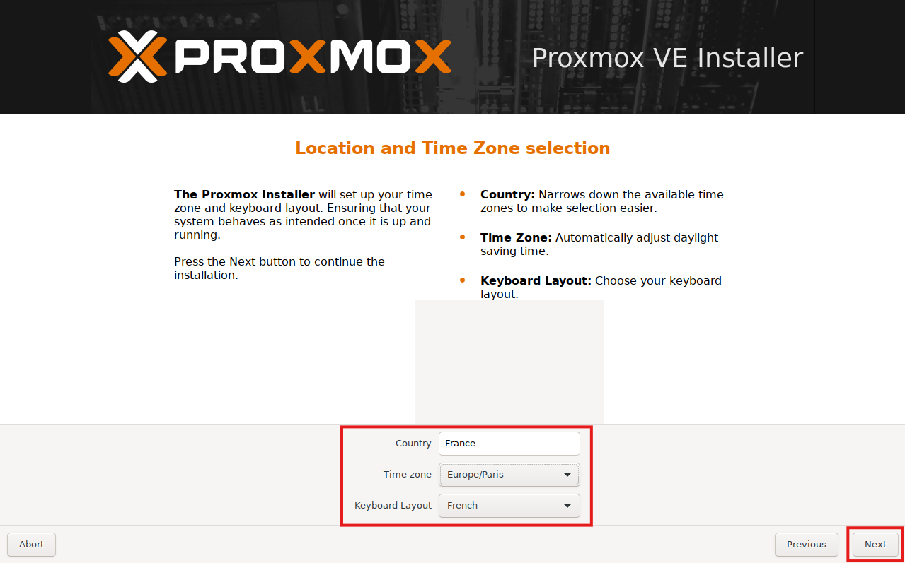
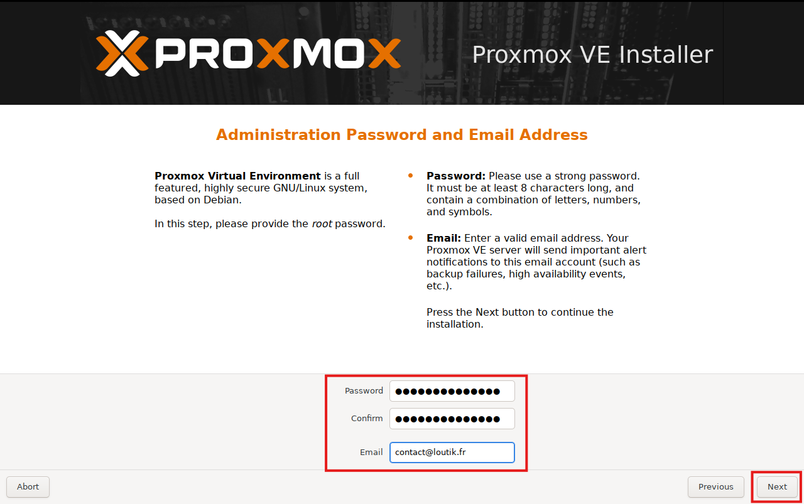
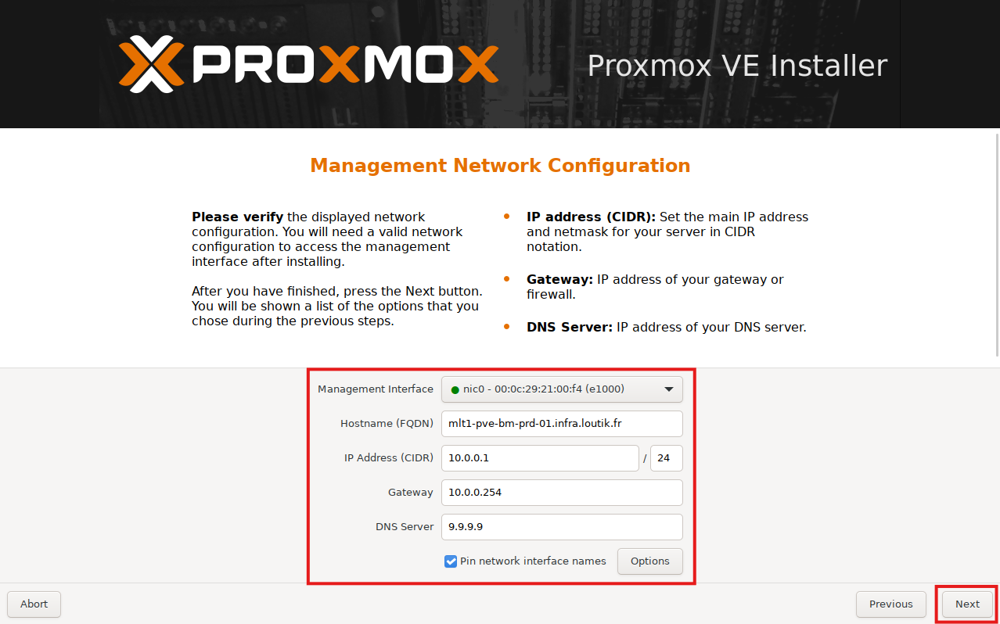
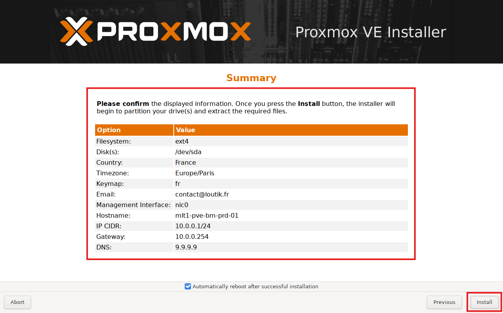

# {{ page.meta.title }}


!!! info "Informations"
    * **Date de création** : {{ page.meta.date }}
    * **Service ciblé** : {{ page.meta.service }}
    * **Auteur** : {{ page.meta.author }}
    * **Responsable** : {{ page.meta.owner }}

## 1. Architecture et contexte
L'installation bare-metal de Proxmox VE sur un nouveau serveur physique permet d'initialiser le socle de virtualisation de base de l'infrastructure LoutikCLOUD. Cet hyperviseur hébergera les futures machines virtuelles et les ressources d'orchestration. Il est impératif de placer temporairement l'hyperviseur dans le VLAN de commissionnement (ID: 60). Ce réseau isolé permet un accès temporaire à Internet depuis une IP de management le temps de la configuration initiale.

## 2. Prérequis

* Télécharger l'image ISO d'installation de l'hyperviseur ([lien de téléchargement](https://www.proxmox.com/en/downloads/proxmox-virtual-environment/iso)).
* Disposer d'une connectivité réseau avec un accès à internet actif.
* Le port réseau du commutateur doit être configuré temporairement sur le VLAN de commissionnement (VLAN ID 60).

## 3. Procédure d'installation bare-metal

1.  **Démarrage et sélection du mode d'installation.** Amorcer le serveur sur le support d'installation. Cliquer sur l'option "Install Proxmox VE (Graphical)" depuis le menu de démarrage.
    
    

2.  **Acceptation des conditions d'utilisation.** Lire et accepter le contrat de licence (EULA) de l'environnement virtuel Proxmox.
    
    

3.  **Sélection du disque cible.** Choisir le support de stockage physique qui va héberger le système d'exploitation de l'hyperviseur. Sur l'infrastructure LoutikCLOUD, il faut impérativement sélectionner le disque SSD NVMe. Il ne faut pas sélectionner le disque dur destiné au stockage des futures machines virtuelles.
    
    

4.  **Configuration régionale.** Définir la localisation et le fuseau horaire du serveur. Renseigner le pays ("France"), la zone temporelle ("Europe/Paris") et la disposition du clavier ("French").
    
    

5.  **Paramétrage du compte administrateur système.** Configurer les accès pour le compte root local. Renseigner un mot de passe robuste (mot de passe par défaut pour Ansible : Ansible123456*). Saisir l'adresse email de contact (`contact@loutik.fr`) pour la réception des alertes critiques de l'hyperviseur.
    
    

6.  **Configuration du réseau de management.** Appliquer la configuration IP statique préalablement définie dans l'IPAM de l'infrastructure. Renseigner l'interface de management, le nom d'hôte complet (FQDN), l'adresse IP avec son masque (CIDR), la passerelle par défaut et le serveur DNS.
    
    

7.  **Validation et déploiement.** Vérifier l'exactitude du résumé des paramètres (système de fichiers `ext4`, disque `/dev/sda`, réseau). Il est normal que ces paramètres diffèrent de l'exemple selon le nœud. Confirmer l'installation pour lancer le partitionnement. S'assurer que l'option de redémarrage automatique après l'installation est cochée.
    
    

## 4. Validation

- [ ] Vérifier la disponibilité de l'interface web d'administration après le redémarrage depuis l'accès physique (shell).

    ```bash
    systemctl status pveproxy
    ```

    `systemctl` : Utilitaire de contrôle du gestionnaire de système et de services.

    `status pveproxy` : Affiche l'état d'exécution du démon Proxmox VE API Proxy, confirmant que le serveur écoute bien sur le port TCP 8006 pour les accès web sécurisés.

- [ ] Accès à l'interface d'administration depuis le navigateur internet

    ```
    https://<ip-proxmox>:8006
    ```

---

## Annexe

- [Documentation officielle Proxmox VE - Bare-metal Installation](https://pve.proxmox.com/pve-docs/chapter-pve-installation.html)