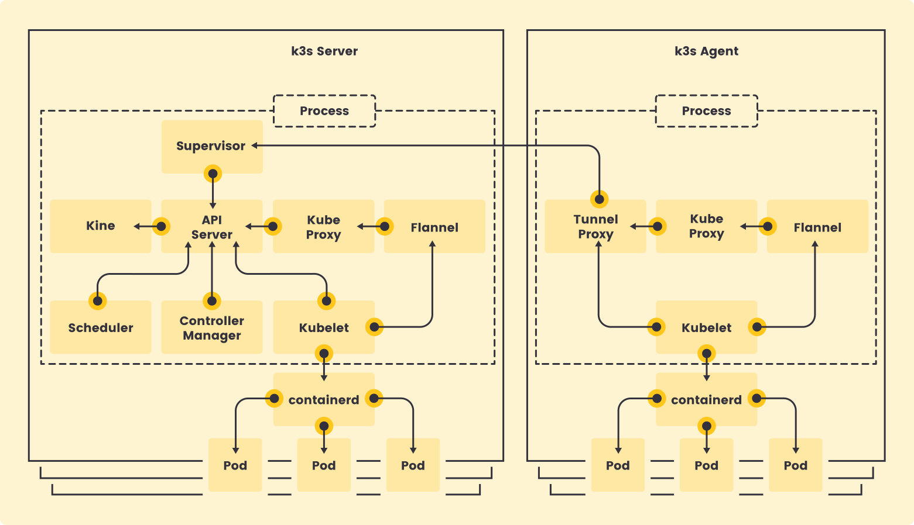

# {{ page.meta.title }}

!!! info "Informations"
    * **Date de création** : {{ page.meta.date }}
    * **Service ciblé** : {{ page.meta.service }}
    * **Auteur** : {{ page.meta.author }}
    * **Responsable** : {{ page.meta.owner }}

## 1. Contexte
Ce document détaille l'architecture logicielle de K3s pour l'infrastructure LoutikCLOUD. K3s optimise drastiquement l'empreinte système en regroupant les composants Kubernetes classiques au sein de processus uniques pour les rôles Serveur et Agent.

## 2. Schéma de l'architecture interne K3s

*Schéma du fonctionnement interne de k3s - [source image](https://docs.k3s.io/architecture)*

## 3. Analyse des Composants

### 3.1. Le Serveur K3s (`k3s server`)

Le nœud serveur héberge les composants du Control Plane et le datastore au sein d'un seul processus système global.

* **Supervisor** : Point d'entrée gérant les connexions entrantes des agents via un load-balancer local sur le port 6443.
* **API Server** : Communiquant avec tous les autres sous-composants internes.
* **Kine** : Interface permettant à l'API Server de communiquer avec le datastore (SQLite embarqué en mode single-node, ou etcd externe/embarqué en configuration Haute Disponibilité).
* **Scheduler & Controller Manager** : Planifient les charges de travail et maintiennent l'état du cluster, directement branchés à l'API Server.
* **Composants d'exécution locaux** : Le serveur exécute également `Kubelet`, `Kube Proxy`, `Flannel` (CNI), et `containerd` (CRI), ce qui lui permet d'héberger directement des Pods (seulement les Pods systèmes, pas d'application ici !).

### 3.2. L'Agent K3s (`k3s agent`)

Le nœud agent est dédié à l'exécution des charges de travail (Pods), sans héberger de composants de Control Plane ni de datastore. Son architecture repose également sur un processus unique.

* **Tunnel Proxy** : Load-balancer côté client qui maintient une connexion websocket dynamique et stable avec le Supervisor du serveur, tolérant ainsi les coupures.
* **Kube Proxy & Flannel** : Assurent le routage réseau et le CNI, en communiquant avec le Control Plane à travers le Tunnel Proxy.
* **Kubelet** : Agent de supervision du nœud qui s'interface avec le moteur d'exécution.
* **Containerd** : Le moteur d'exécution (CRI) piloté par Kubelet pour gérer le cycle de vie des Pods.

## Annexe

* [Documentation officielle K3s - Architecture](https://docs.k3s.io/architecture)