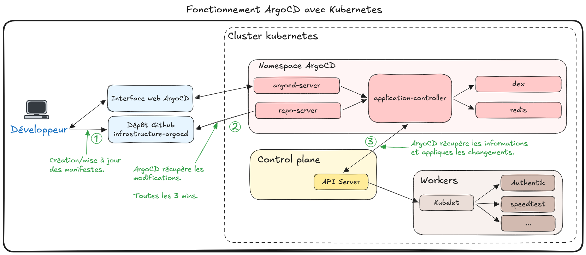

# {{ page.meta.title }}

!!! info "Informations"
    * **Date de création** : {{ page.meta.date }}
    * **Service ciblé** : {{ page.meta.service }}
    * **Auteur** : {{ page.meta.author }}
    * **Responsable** : {{ page.meta.owner }}

## 1. Contexte

L'infrastructure de LoutikCLOUD s'appuie sur ArgoCD pour automatiser le déploiement des manifestes Kubernetes. Cette approche orientée GitOps garantit une traçabilité complète des modifications via les dépôts Git, tout en assurant la capacité de reconstruire l'infrastructure de manière rapide, fiable et reproductible en cas de sinistre.

## 2. Schéma de l'architecture interne ArgoCD

*Schéma du fonctionnement interne de ArgoCD*

## 3. Explication des composants

### API Server
Il s'agit du point d'entrée principal exposant une API gRPC/REST. Il gère les requêtes provenant de l'interface web ou de la ligne de commande (CLI), authentifie les utilisateurs et orchestre la communication avec les autres composants internes.

### Repository Server
Ce service est responsable du clonage, de la mise en cache et de l'analyse des dépôts Git contenant l'infrastructure as code. Il génère les manifestes Kubernetes finaux à partir d'outils de templating (comme Helm ou Kustomize) pour définir l'état souhaité.

### Application Controller
Il représente le cœur de la réconciliation GitOps en comparant continuellement l'état désiré (défini dans Git) avec l'état actuel (déployé dans le cluster Kubernetes). Il détecte les désynchronisations et se charge d'appliquer les corrections nécessaires si la synchronisation automatique est activée.

### Redis (Cache)
C'est une base de données en mémoire utilisée pour stocker temporairement l'état des ressources du cluster Kubernetes et accélérer les requêtes de l'interface utilisateur. Son rôle est d'optimiser les performances globales et de limiter la surcharge sur l'API serveur de Kubernetes.

### Dex (Identity Provider)
Ce composant gère la fédération d'identités pour l'authentification. Il permet d'interconnecter ArgoCD avec des fournisseurs de type SSO (Single Sign-On) externes tels que LDAP, OIDC, ou SAML, assurant ainsi une gestion centralisée et sécurisée des accès.