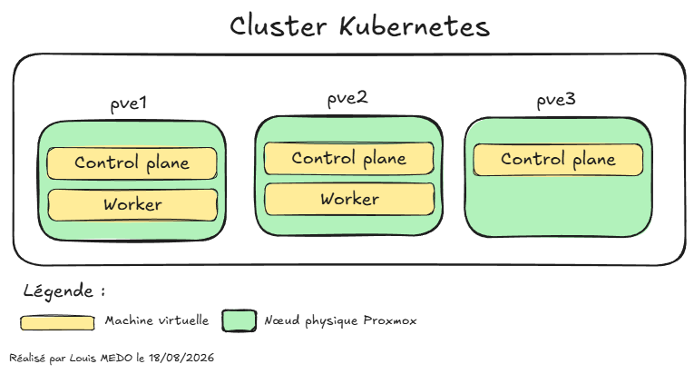

# {{ page.meta.title }}

!!! info "Informations"
    * **Date de création** : {{ page.meta.date }}
    * **Service ciblé** : {{ page.meta.service }}
    * **Auteur** : {{ page.meta.author }}
    * **Responsable** : {{ page.meta.owner }}

## 1. Contexte
Ce document détaille l'architecture logique du cluster Kubernetes haute disponibilité déployé sur l'infrastructure Proxmox (pve1, pve2, pve3). Le cluster repose sur 3 Control Planes (un par nœud Proxmox pour assurer le quorum) et 2 Workers (sur pve1 et pve2 pour les charges de travail stateless). Le nœud pve3 est exclusivement dédié à l'hébergement des données d'infrastructure et aux éléments nécessitant un stockage persistant (stateful).

## 2. Schéma logique de l'infrastructure Kubernetes

Le schéma ci-desssus illustre la stratégie de répartition physique des machines virtuelles pour garantir la haute disponibilité et la résilience :

* **Quorum** : Les trois nœuds Control Plane sont distribués sur trois hyperviseurs physiques distincts (`pve1`, `pve2`, `pve3`). Cette topologie permet de tolérer la perte complète d'un nœud physique sans perdre le quorum de la base de données distribuée.
* **Ségrégation des charges de travail** : Les Workers hébergeant les applications *stateless* sont isolés sur `pve1` et `pve2`. 

!!! info "Spécification de l'infrastructure"
    Sur l'infrastructure LoutikCLOUD, le `pve3` est réservé aux **machines virtuelles stateful**. Cependant, pour bénéficier du quorum, il est nécessaire d'avoir au moins trois contrôles planes. Donc, il a été décidé de faire une exception pour un control plane Kubernetes.