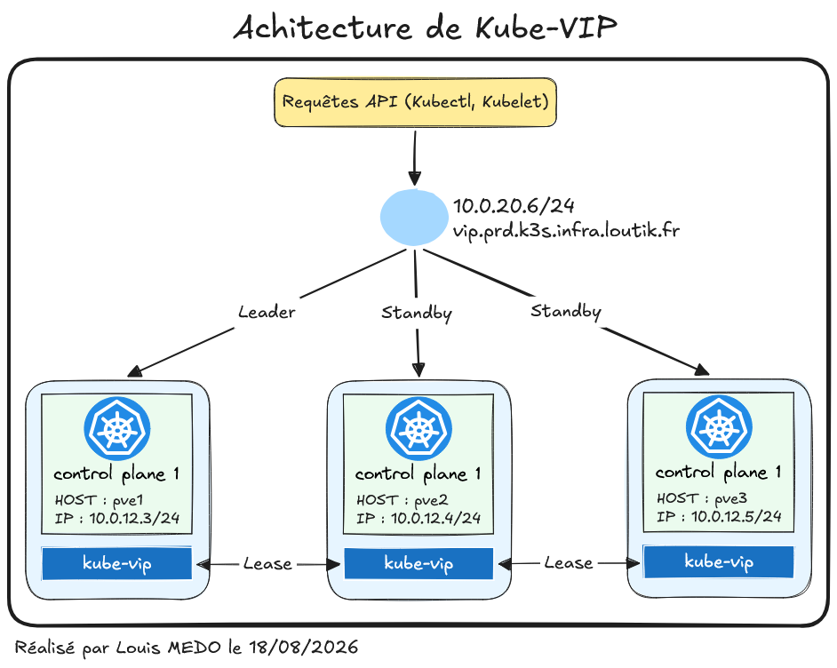
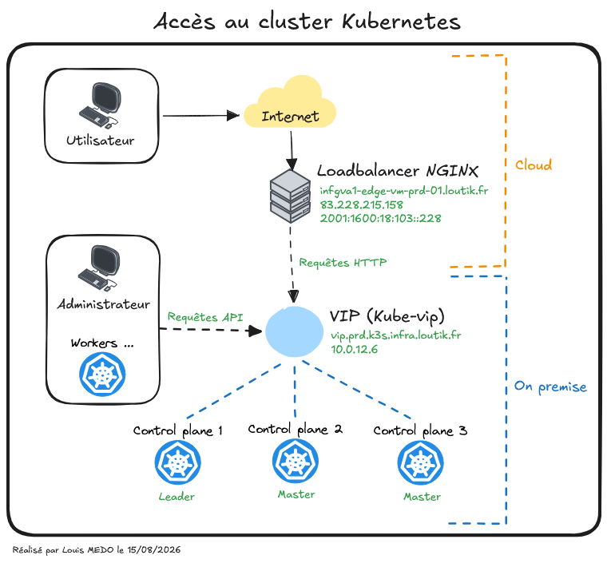

# {{ page.meta.title }}

!!! info "Informations"
    * **Date de création** : {{ page.meta.date }}
    * **Service ciblé** : {{ page.meta.service }}
    * **Auteur** : {{ page.meta.author }}
    * **Responsable** : {{ page.meta.owner }}

## 1. Contexte
Ce document détaille l'architecture logique de la Virtual IP (VIP) du cluster Kubernetes. Kube-vip fournit un point d'entrée réseau unique, distribué et hautement disponible pour l'API Kubernetes. L'objectif architectural est de garantir la résilience du plan de contrôle : en cas de perte du nœud actif, l'IP virtuelle bascule sur un nœud sain sans interruption du trafic interne (kubelet/kube-proxy) ou externe (kubectl/pipelines).

**Schéma logique de l'architecture Kube-VIP :**

*Achirecture kube-vip - LoutikCLOUD*

## 2. Architecture Logique et Mécanismes

2.1. **Mécanisme d'élection de Leader (Leader Election).** Le cluster s'appuie sur le système de bail (ressource `Lease`) natif de Kubernetes. Un seul composant Kube-VIP acquiert le verrou et devient "Leader" (actif), portant ainsi l'IP virtuelle. Si le Leader devient silencieux (panne ou timeout), un des nœuds "Standby" récupère le bail.

2.2. **Protocole de basculement (Mode Couche 2).** La haute disponibilité est assurée par l'émission de requêtes *Gratuitous ARP* (GARP). Lors d'une bascule de Leader, le nouveau nœud actif diffuse immédiatement une trame sur le réseau local. Cette trame force la mise à jour des tables de routage (routeur et commutateurs), associant instantanément la VIP à la nouvelle adresse MAC physique du nœud prenant le relais.

2.3. **Modèle d'exécution (Static Pod).** Kube-vip est architecturé sous forme de Pod Statique. Contrairement à un DaemonSet classique, il est géré directement par le Kubelet du nœud sans dépendre de l'état de l'API Kubernetes. Ce choix d'ingénierie est critique : il garantit que le composant de haute disponibilité démarre et expose l'IP virtuelle avant même que le scheduler ou le plan de contrôle Kubernetes ne soient totalement opérationnels.

---

## Annexe

* [Documentation Kube-VIP - Architecture Couche 2 (ARP)](https://kube-vip.io/docs/about/architecture/)

*Schéma d'exemple d'un accès à la VIP kubernetes*