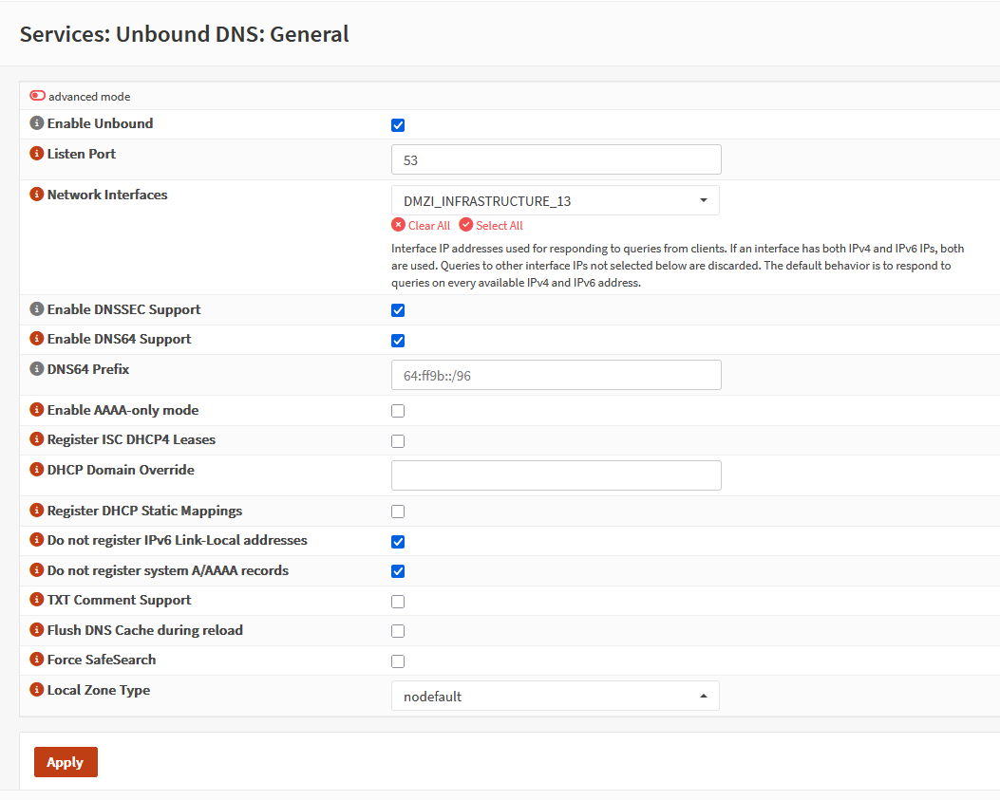
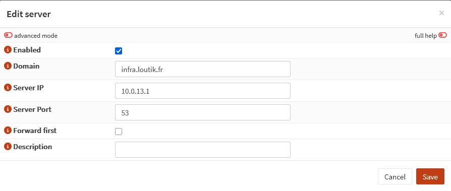

# {{ page.meta.title }}

!!! info "Informations"
    * **Date de création** : {{ page.meta.date }}
    * **Service ciblé** : {{ page.meta.service }}
    * **Auteur** : {{ page.meta.author }}
    * **Responsable** : {{ page.meta.owner }}

## 1. Architecture et contexte
Déploiement du service Unbound DNS sur le pare-feu OPNsense pour agir comme serveur DNS récursif principal pour les machines de l'infrastructure LoutikCLOUD. L'architecture cible exige que ce service assure la résolution des noms de domaine publics sur Internet, tout en redirigeant spécifiquement les requêtes du domaine interne (`infra.loutik.fr`) vers le serveur DNS faisant autorité (PowerDNS) hébergé en interne, via un mécanisme de "Query Forwarding".

## 2. Prérequis

* **Infrastructure système** : Pare-feu OPNsense fonctionnel et accessible avec des droits d'administration.
* **Réseau** : Interface réseau interne configurée sur OPNsense (ex: `DMZI_INFRASTRUCTURE_13`).
* **Dépendance service** : Serveur PowerDNS opérationnel pour la zone locale sur l'adresse IP `10.0.13.1`, écoutant sur le port `53`.

## 3. Configuration du service Unbound DNS

3.1. **Configuration générale de la résolution DNS.** Activer le démon Unbound, sécuriser les requêtes et restreindre l'écoute à l'interface de l'infrastructure. Se rendre dans `Services` > `Unbound DNS` > `General`.

  **Configuration :**

  * **Enable Unbound** : `Coché`
  * **Listen Port** : `53`
  * **Network Interfaces** : `DMZI_INFRASTRUCTURE_13`
  * **Enable DNSSEC Support** : `Coché`
  * **Do not register system A/AAAA records** : `Coché`
  * **Local Zone Type** : `nodefault`
  
  

  * `Enable Unbound` : Active le démon (daemon) de résolution récursive local.
  * `Listen Port` : Port d'écoute standard TCP/UDP du protocole DNS.
  * `Network Interfaces` : Bind du service. Indique au processus de n'ouvrir un socket réseau que sur cette interface spécifique.
  * `Enable DNSSEC Support` : Active la validation cryptographique des signatures DNS (DNS Security Extensions) pour garantir l'intégrité et l'authenticité des réponses Internet.
  * `Do not register system A/AAAA records` : Empêche le système d'exploitation OPNsense d'injecter automatiquement ses propres adresses IP dans le résolveur, évitant la pollution DNS locale.
  * `Local Zone Type` : Désactive le comportement par défaut d'Unbound qui bloque ou redirige nativement certaines zones (comme les adresses privées RFC1918). Indispensable pour que le Query Forwarding vers ton serveur PowerDNS fonctionne sans conflit.

3.2. **Configuration du Query Forwarding.** Paramétrer le transfert de requêtes (forwarding) pour diriger la résolution du domaine privé vers le backend PowerDNS. Dans `Services` > `Unbound DNS` > `Query Forwarding` cliquer sur `+` pour ajouter une entrée.

  **Configuration :**

  * **Enabled** : `Coché`
  * **Domain** : `infra.loutik.fr`
  * **Server IP** : `10.0.13.1`
  * **Server port :** `53`

  

  * `Domain` : Domaine cible qui nécessite une résolution locale.
  * `Server IP` : Adresse IP du serveur PowerDNS interne.
  * `server Port` : Port d'écoute du serveur PowerDNS.

3.3. **Application des modifications.** Appliquer la configuration pour redémarrer le service Unbound et purger le cache de résolution. Cliquer sur le bouton `Apply`.

## Annexe

- [Documentation officielle OPNsense Unbound DNS](https://docs.opnsense.org/manual/unbound.html)