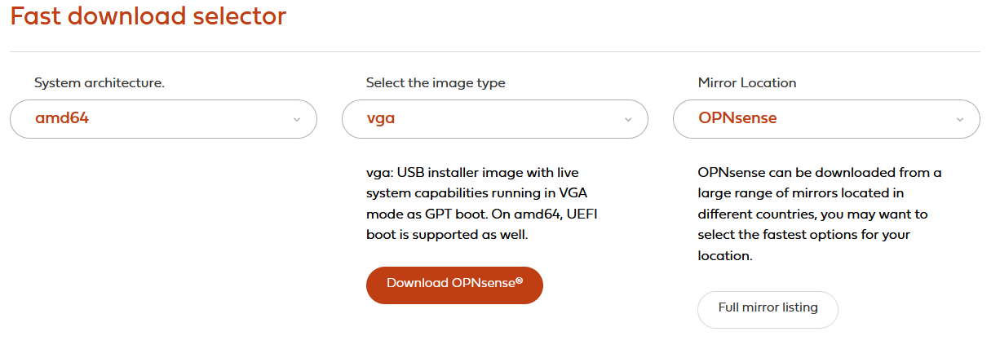
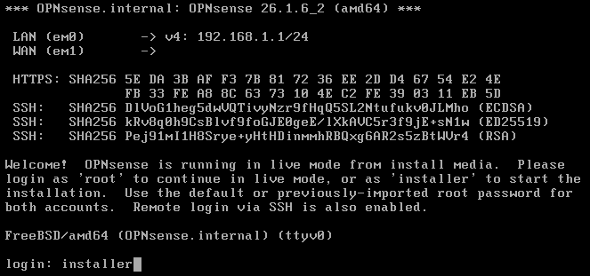
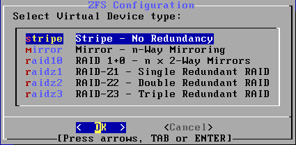

# {{ page.meta.title }}


!!! info "Informations"
    * **Date de création** : {{ page.meta.date }}
    * **Service ciblé** : {{ page.meta.service }}
    * **Auteur** : {{ page.meta.author }}
    * **Responsable** : {{ page.meta.owner }}

## 1. Architecture et contexte
Mise en production du premier routeur de l'infrastructure LoutikCLOUD sans processus IaC. L'objectif est de provisionner un routeur opérationnel avec un nom de domaine défini, un compte utilisateur sécurisé, et une configuration WAN/LAN de base permettant un accès Internet fonctionnel via NAT. Cette configuration initiale manuelle rendra la console Web accessible depuis le réseau local, constituant ainsi le socle requis pour la future orchestration et configuration automatisée via Ansible.

## 2. Prérequis

* Ressources allouées : machine avec au moins deux interfaces réseau virtuelles distinctes (WAN et LAN).
* Réseau : Adressage planifié (Réseau LAN `10.0.20.0/24`, passerelle WAN `172.16.1.1/24`).

## 3. Téléchargement de l'ISO OPNsense

3.1. **Récupération de l'image.** Téléchargez l'image d'installation officielle depuis le site d'OPNsense.

  * [https://opnsense.org/download/](https://opnsense.org/download/)

  

  `Architecture` : Sélectionnez `amd64`, correspondant à la norme pour les processeurs récents.

  `Type d'image` : Sélectionnez `vga` si vous installez sur un matériel physique avec écran/clavier, ou `dvd` si vous montez l'image sur une machine virtuelle.

## 4. Installation de OPNsense

4.1. **Démarrage en mode Live OS.** L'image OPNsense va être chargée sur la machine, afin que le système soit accessible en "live". Connectez-vous à l'aide du login "installer" et du mot de passe "opnsense".

  ```bash
  login: installer
  password: opnsense
  ```

  `installer` : Compte permettant de lancer l'assistant d'installation sur le disque.

  `opnsense` : Mot de passe par défaut. Attention, le mappage clavier est en QWERTY par défaut à cette étape.

  

4.2. **Configuration du système de fichiers et du clavier.** Pour un clavier AZERTY, sélectionnez l'option "French (accent keys)". Sélectionnez ensuite "Install (ZFS)" et choisissez "stripe" puisque notre machine est équipée d'un seul disque. Validez la destruction des données du disque pour lancer le formatage.

  ```bash
  Keymap : French (accent keys)
  Task : Install (ZFS)
  Virtual Device type : Stripe
  ```

  `French (accent keys)` : Adapte la saisie à la norme française.

  `Stripe` : Formatage ZFS sans redondance matérielle, idéal pour une machine virtuelle mono-disque.

  

4.3. **Création du compte administrateur.** À la fin de l'installation, sélectionnez "Root Password", appuyez sur Entrée et indiquez un mot de passe "root". Sélectionnez ensuite "Complete Install" et appuyez sur Entrée pour redémarrer.

  ```bash
  Root Password: Azertyuiop123456*
  ```

  `Azertyuiop123456*` : Mot de passe administrateur utilisé pour se connecter à la console locale et à l'interface Web.

## 5. Configuration post installation

5.1. **Association des interfaces réseau.** Une fois redémarré, connectez-vous avec le compte "root". Faites le choix "1" et appuyez sur Entrée pour associer les cartes réseaux. L'assistant propose de configurer une agrégation de liens et des VLANs, indiquez "n" pour refuser. Vous devez affecter les deux interfaces: "hn0" et "hn1" au WAN et au LAN.

  ```bash
  Enter an option: 1
  Do you want to configure LAGGs now? [y/N]: n
  Do you want to configure VLANs now? [y/N]: n
  Enter the WAN interface name: hn0
  Enter the LAN interface name: hn1
  ```

  `hn0` : Interface physique de sortie (WAN).

  `hn1` : Interface physique interne (LAN).

5.2.  **Configuration IP du LAN.** Dans le menu principal de la console, utilisez l'option 2 (`Set interface IP address`) pour configurer l'interface `LAN`.

  ```bash
  Enter an option: 2
  Configure IPv4 address LAN interface via DHCP: n
  Enter the new LAN IPv4 address: 10.0.199.254
  Subnet bit count: 24
  IPv4 Upstream Gateway: [Laisser vide / None]
  Configure IPv6 address LAN interface via WAN tracking: Y
  Do you want to enable the DHCP server on LAN: N
  Do you want to change the web GUI protocol from HTTPS to HTTP: N
  Do you want to generate a new self-signed web GUI certificate: N
  Restore web GUI access defaults: N
  ```

  `10.0.20.1` : Adresse IP locale définie pour le routeur.

  `Upstream Gateway` : Ne spécifiez aucune passerelle pour le LAN afin d'éviter les boucles de routage.

5.3. **Configuration IP du WAN.** Répétez l'opération avec l'option 2 pour configurer l'interface `WAN`.

  ```bash
  Enter an option: 2
  Configure IPv4 address WAN interface via DHCP: n
  Enter the new WAN IPv4 address: 172.16.1.253
  Subnet bit count: 24
  IPv4 Upstream Gateway: 172.16.1.1
  IPv4 name server: 9.9.9.9
  Configure IPv6 address WAN interface via DHCP6: Y
  Do you want to change the web GUI protocol from HTTPS to HTTP: N
  Do you want to generate a new self-signed web GUI certificate: N
  Restore web GUI access defaults: N
  ```

  `172.16.1.1` : La passerelle par défaut du fournisseur d'accès ou du pare-feu parent.

5.4.  **Accès à l'interface Web et configuration NAT.** Depuis une machine connectée au réseau LAN, ouvrez un navigateur Web pour accéder à l'interface d'administration. 

  ```bash
  URL : <ip-opnsense> | https://10.0.20.254
  Identifiant : root
  Mot de passe : Azertyuiop123456*
  ```

  `URL` : Point de terminaison sécurisé du pare-feu OPNsense.

  `Configuration NAT` : Dans l'interface Web, naviguez vers **Interfaces > [WAN]** pour décocher `Block private networks` et `Block bogon networks`. Allez ensuite dans **Firewall > NAT > Outbound**, sélectionnez `Automatic outbound NAT rule generation` et sauvegardez pour autoriser la traduction d'adresse et débloquer l'accès Internet pour le LAN `10.0.20.0/24`.

## Annexe

- [Documentation OPNsense - Installation](https://docs.opnsense.org/manual/install.html)
- [Référentiel des normes de nommage réseau LoutikCLOUD](../../../01-architecture/referentiels/ref-003-convention-nommage-reseau-pare-feu.md)