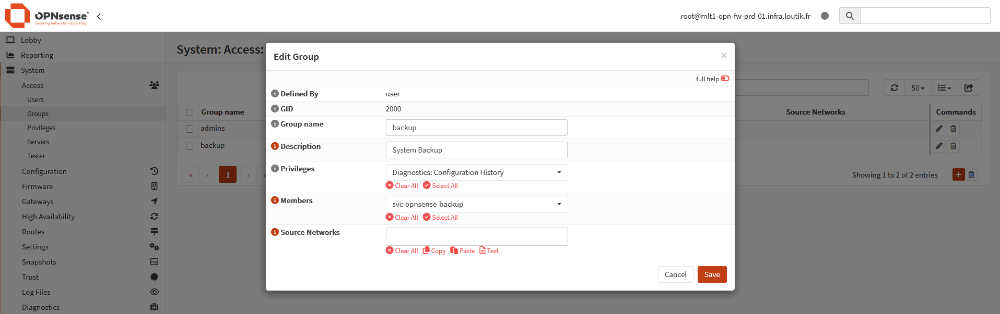
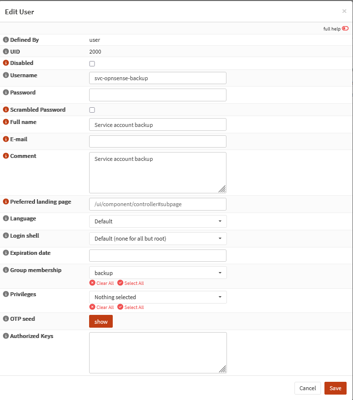
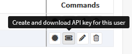

# {{ page.meta.title }}


!!! info "Informations"
    * **Date de création** : {{ page.meta.date }}
    * **Service ciblé** : {{ page.meta.service }}
    * **Auteur** : {{ page.meta.author }}
    * **Responsable** : {{ page.meta.owner }}

## 1. Contexte
Ce runbook documente la création d'un compte de service (`svc-opnsense-backup`) et de son groupe de sécurité associé (`backup`) sur le pare-feu OPNsense.

## 2. Prérequis

* Accès administrateur (`root` ou équivalent) à l'interface web d'OPNsense.
* Un gestionnaire de secrets (Vault) pour générer et stocker de manière sécurisée le mot de passe du compte de service.
* Connectivité réseau autorisée entre le serveur Ansible et l'interface de management OPNsense.

## 3. Création du groupe de sauvegarde

3.1. **Configuration du groupe.** Naviguer dans le menu `System` > `Access` > `Groups` de l'interface OPNsense, puis cliquer sur l'icône `+` pour ajouter un nouveau groupe en lui attribuant les droits de diagnostique.

  ```text
  Group name: backup
  Description: System Backup
  Privileges: Diagnostics: Configuration History
  ```

  

  * `Group name` : Définit le nom de l'entité logique de regroupement des droits.
  * `Privileges` : Autorise uniquement l'accès à l'historique et l'exportation de la configuration, bloquant toute modification.

## 4. Création de l'utilisateur de service

4.1. **Déploiement du compte utilisateur.** Naviguer dans le menu `System` > `Access` > `Users`, cliquer sur l'icône `+` pour créer le compte applicatif et l'associer au groupe de sauvegarde.

  ```text
  Username: svc-opnsense-backup
  Full name: Service account backup
  Group membership: backup
  ```

  

  * `Username` : Identifiant utilisé par les pipelines CI/CD ou Ansible pour l'authentification.
  * `Group membership` : Assigne les autorisations du groupe `backup` (Diagnostics: Configuration History) au compte de service.

## 5. Création des accès API

5.1. **Génération de la clé d'authentification.** Depuis la liste des utilisateurs (`System` > `Access` > `Users`), identifier le compte `svc-opnsense-backup` et cliquer sur l'icône de création de clé API pour générer et télécharger automatiquement le fichier contenant les identifiants.

  ```text
  key=VOTRE_CLE_API
  secret=VOTRE_SECRET_API
  ```

  

  * `key` : Clé publique agissant comme identifiant (username) pour l'authentification auprès de l'API REST OPNsense.
  * `secret` : Jeton cryptographique privé (password) permettant de valider l'authentification. Il doit être immédiatement stocké dans une solution de gestion des secrets (ex: Vault, Ansible Vault) et ne jamais être commité en clair.

## Annexe

- [Documentation officielle OPNsense - User and Group Management](https://docs.opnsense.org/manual/users.html)