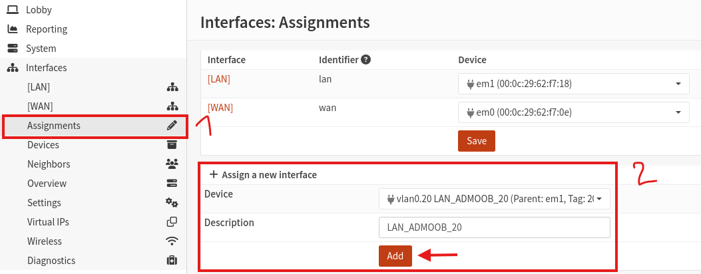

# {{ page.meta.title }}


!!! info "Informations"
    * **Date de création** : {{ page.meta.date }}
    * **Service ciblé** : {{ page.meta.service }}
    * **Auteur** : {{ page.meta.author }}
    * **Responsable** : {{ page.meta.owner }}

## 1. Architecture et contexte
Cette procédure décrit la mise en place de la segmentation réseau de niveau 2 (VLAN) et niveau 3 (Routage) sur le pare-feu OPNsense. Elle consiste à déclarer les interfaces virtuelles 802.1Q sur l'interface physique interne, puis à assigner et configurer l'adressage IP statique pour chaque zone isolée (DMZE, DMZI, ZDS, LAN). Cette étape est structurée autour du référentiel de nommage pour garantir la lisibilité et l'automatisation future. C'est un prérequis absolu avant la création des alias de pare-feu et la bascule définitive de l'administration sur le réseau de management dédié.

## 2. Prérequis

* Routeur OPNsense installé et configuration de Bootstrap validée (accès via l'interface LAN initiale).
* Interface réseau physique interne (ex: `hn1`, `vmx1` ou `em1`) configurée et connectée à un commutateur gérant le protocole 802.1Q (Trunk).
* Consultation du référentiel **REF-003 (Convention de nommage réseau et pare-feu)** pour connaître les valeurs autorisées des segments de nommage.

## 3. Création logique des VLANs (802.1Q)

3.1. **Déclaration des tags VLAN.** Depuis l'interface Web, naviguez dans `Interfaces > Devices > VLAN` et cliquez sur le bouton "+" pour créer les réseaux virtuels un par un.

  ```bash
  Parent interface : hn1
  VLAN tag : 12
  VLAN priority : 0
  Description : DMZI_SVC_12
  ```

  `Parent interface` : L'interface physique interne (Trunk) qui transportera le trafic tagué pour les réseaux LAN et DMZ.

  `VLAN tag` : L'identifiant 802.1Q numérique du réseau.

  `Description` : Nommage strict respectant le format `[ZONE]_[FONCTION]_[ID]` et les valeurs autorisées (ex: `DMZI` et `SVC`) définies dans le **REF-003, Section 2.1**.

## 4. Assignation des nouvelles interfaces

4.1. **Attachement au système de routage.** Se rendre dans `Interfaces > Assignments` pour lier les VLANs créés à des interfaces logiques OPNsense exploitables par le pare-feu.

  ```bash
  New interface : vlan0.12 (DMZI_SVC_12)
  Description : DMZI_SVC_12
  ```

  `New interface` : Sélectionnez le VLAN précédemment créé dans la liste déroulante en bas de page, puis cliquez sur le bouton "+".

  `Description` : Renommez immédiatement l'interface assignée (ex: `OPT1`) avec exactement le même nom que le VLAN en respectant la casse (majuscules obligatoires), tel qu'exigé par le **REF-003, Section 2.1**.

  

## 5. Configuration de l'adressage IP (Statique)

5.1. **Activation et configuration IPv4.** Pour chaque interface nouvellement assignée (qui apparaît désormais dans le menu de gauche sous `Interfaces`), configurez l'adresse IP qui servira de passerelle pour cette zone.

  ```bash
  Enable : Coché
  IPv4 Configuration Type : Static IPv4
  IPv4 address : 10.0.12.254 / 24
  IPv4 Upstream Gateway : Auto / None
  ```

  `Enable` : Cochez cette case pour allumer l'interface.

  `IPv4 address` : Renseignez l'adresse IP statique du routeur pour ce sous-réseau, suivie de son masque CIDR.

  `IPv4 Upstream Gateway` : Ce champ doit impérativement rester vide (None ou Auto) pour les interfaces locales afin d'éviter la création de boucles de routage. Le routeur est lui-même la passerelle de ces réseaux.

## Annexe

* [REF-003 - Convention de nommage réseau et pare-feu](../../../01-architecture/referentiels/ref-003-convention-nommage-reseau-pare-feu.md)