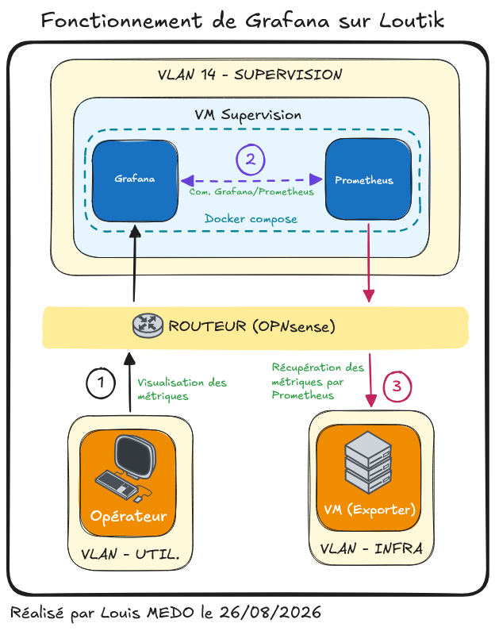

# {{ page.meta.title }}


!!! info "Informations"
    * **Date de création** : {{ page.meta.date }}
    * **Service ciblé** : {{ page.meta.service }}
    * **Auteur** : {{ page.meta.author }}
    * **Responsable** : {{ page.meta.owner }}

## 1. Contexte
Grafana est déployé sur l'infrastructure LoutikCLOUD pour exploiter visuellement les métriques collectées par Prometheus. Alors que Prometheus gère la collecte et le stockage brut, Grafana organise ces données en tableaux de bord intuitifs. Cette séparation des rôles facilite l'analyse, le monitoring et l'alerte pour les équipes opérationnelles.

## 2. Fonctionnement de l'outil

```text
+-------------+        +-------------+        +-------------+
|             |  [1]   |             |  [2]   |             |
| Utilisateur | -----> |   Grafana   | -----> | Prometheus  |
|             | <----- |             | <----- |             |
+-------------+  [3]   +-------------+        +-------------+
```

*Schéma 1 : Logique de récupération et restitution des données par Grafana*

### 2.1. Explications du fonctionnement du schéma

1. **Accès utilisateur.** L'opérateur accède à l'interface web de Grafana pour consulter un tableau de bord spécifique.
2. **Requête des données.** Grafana exécute une requête (ex: PromQL) vers la source de données Prometheus configurée pour récupérer les métriques nécessaires à l'affichage.
3. **Restitution visuelle.** Grafana compile les données brutes retournées par l'API de Prometheus et génère les composants graphiques finaux pour l'utilisateur.

## 3. Fonctionnement de l'outil sur l'infrastructure



*Schéma 2 : Intégration de Grafana sur la VM de supervision LoutikCLOUD*

1. **Accès externe opérationnel.** L'équipe accède à l'interface de Grafana hébergée sur la VM Supervision (VLAN 14) via les requêtes web entrantes.
2. **Communication locale inter-conteneurs.** Grafana et Prometheus sont déployés conjointement via le même fichier `docker-compose.yml`. Grafana interroge Prometheus directement via le réseau virtuel Docker interne, assurant sécurité et faible latence.
3. **Collecte d'infrastructure.** En parallèle, Prometheus gère de manière indépendante le scraping des métriques (Exporters) sur le reste de l'infrastructure réseau.