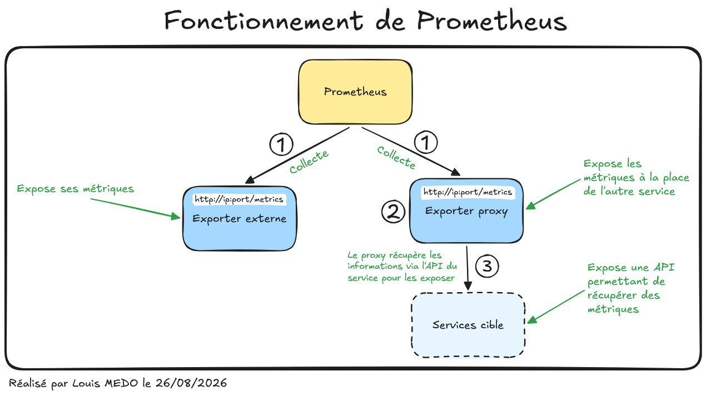
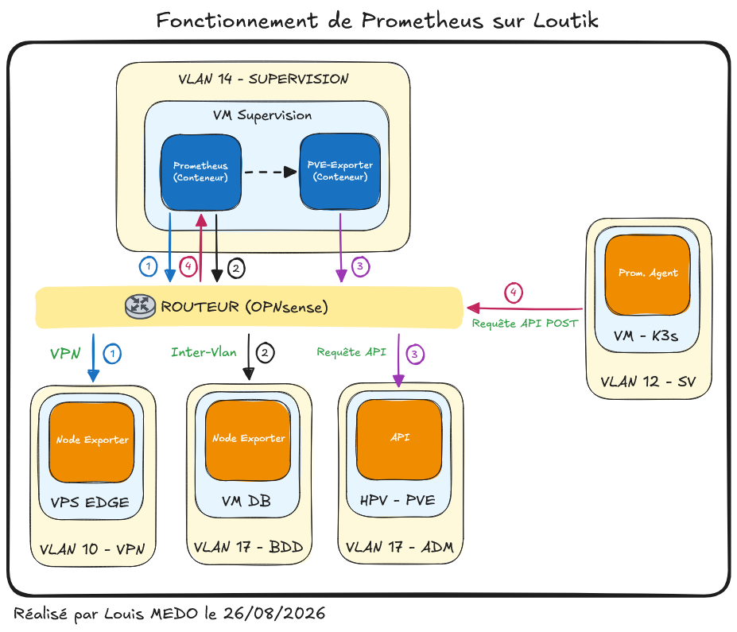

# {{ page.meta.title }}

!!! info "Informations"
    * **Date de création** : {{ page.meta.date }}
    * **Service ciblé** : {{ page.meta.service }}
    * **Auteur** : {{ page.meta.author }}
    * **Responsable** : {{ page.meta.owner }}

## 1. Contexte
Prometheus est utilisé sur l'infrastructure LoutikCLOUD pour la récupération centralisée des métriques. Il a été sélectionné spécifiquement pour sa faible consommation en bande passante grâce à son modèle de collecte par requêtes entrantes ("pull"). Contrairement à d'autres solutions comme InfluxDB, qui nécessitent une mise en œuvre plus complexe et consomment davantage de ressources systèmes, Prometheus s'intègre nativement avec nos environnements de manière légère et performante.

## 2. Fonctionnement de l'outil

*Schéma 1 : Logique de récupération des données par Prometheus*

### 2.1. Explications du fonctionnement du schéma

1. **Collecte directe (Scraping).** Prometheus interroge périodiquement la route HTTP (généralement `/metrics`) exposée par un Exporter externe pour récupérer les données d'un composant de manière autonome.
2. **Interrogation du Proxy.** Pour les services ne pouvant pas exposer leurs propres métriques nativement, Prometheus interroge un Exporter Proxy intermédiaire.
3. **Traduction des requêtes.** L'Exporter Proxy se connecte au protocole spécifique du service cible, récupère son état, et convertit ces informations au format standard attendu par Prometheus.

## 3. Fonctionnement de l'outil sur l'infrastructure

*Schéma 2 : Intégration et flux réseau de Prometheus sur l'infrastructure*

1. **Supervision via VPN Tailscale.** Le serveur Prometheus effectue une requête qui traverse le routeur (OPNsense) pour s'engouffrer dans le tunnel VPN Tailscale afin d'atteindre et scrapper le composant Node Exporter situé sur un hôte distant sécurisé.
2. **Supervision inter-VLAN.** Prometheus interroge la machine virtuelle contenant la base de données. Le flux réseau quitte le VLAN 14 (Supervision), est routé par le pare-feu, puis autorisé à atteindre le VLAN 17 (Database).
3. **Scraping Proxmox via PVE-Exporter.** Le serveur Prometheus interroge localement un PVE-Exporter hébergé dans un conteneur Docker sur la même machine. Le PVE-Exporter envoie ensuite une requête qui traverse le routeur pour interroger l'interface API de l'hyperviseur Proxmox.
4. **Mécanisme Push de l'infrastructure K3s.** Un agent Prometheus (déployé de manière minimale via Helm) collecte les métriques internes du cluster Kubernetes. Contrairement au mécanisme classique, il envoie activement ces données vers le serveur Prometheus du VLAN 14 via une requête API POST (Remote Write).