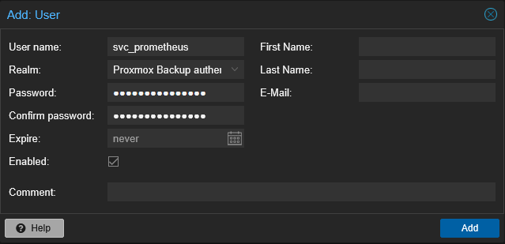
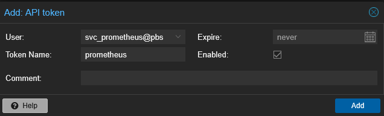
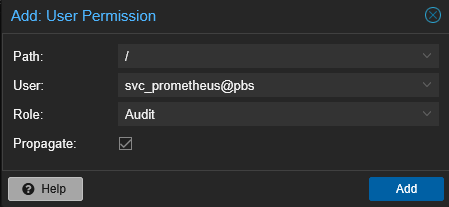
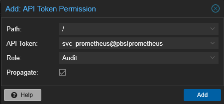

# {{ page.meta.title }}


!!! info "Informations"
    * **Date de création** : {{ page.meta.date }}
    * **Service ciblé** : {{ page.meta.service }}
    * **Auteur** : {{ page.meta.author }}
    * **Responsable** : {{ page.meta.owner }}

## 1. Contexte
Déploiement d'un compte de service et d'un jeton d'API (Token) sur Proxmox Backup Server (PBS). Cette configuration permet à la stack de supervision LoutikCLOUD, via le conteneur `pbs-exporter`, de s'authentifier et de collecter les métriques du service (état des datastores, statut des sauvegardes) en mode pull (Prometheus), tout en respectant le principe du moindre privilège (lecture seule).

## 2. Prérequis

* Accès administrateur (`root@pam`) à l'interface web du Proxmox Backup Server cible.
* Le gestionnaire de secrets (Vault) prêt à réceptionner la clé de l'API générée.
* Architecture de supervision (Prometheus / pbs-exporter) en cours de déploiement.

## 3. Création de l'utilisateur de service

3.1. **Ajout du compte utilisateur.** Depuis l'interface web PBS, naviguer dans `Configuration` > `Access Control` > `User Management` et cliquer sur `Add`.



```text
User name: svc_prometheus
Realm: Proxmox Backup authentication server
```

`User name` : Identifiant standardisé du compte de service.

`Realm` : Domaine de sécurité interne à PBS (pas de dépendance PAM).

## 4. Création du Token API

4.1. **Génération du jeton.** Toujours dans `Access Control`, basculer sur l'onglet `API Token` et cliquer sur `Add`. 



```text
User: svc_prometheus@pbs
Token Name: prometheus
```

`User` : Sélection de l'utilisateur créé à l'étape 3.1.

`Token Name` : Nom d'identification du jeton. L'identifiant complet deviendra `svc_prometheus@pbs!prometheus`. (⚠️ Le "Secret" affiché à la validation doit être immédiatement sauvegardé dans le Vault).

## 5. Attribution des permissions

5.1. **Affectation du rôle sur l'utilisateur.** Naviguer dans `Configuration` > `Access Control` > `Permissions`. Cliquer sur `Add` puis `User Permission`.



```text
Path: /
User: svc_prometheus@pbs
Role: Audit
```

`Path` : Chemin racine permettant d'auditer l'ensemble des datastores et tâches.

`Role` : Rôle limitant l'accès strictement à la lecture seule (Audit).

5.2. **Affectation du rôle sur le Token API.** Dans le même menu `Permissions`, cliquer de nouveau sur `Add` puis `API Token Permission`.



```text
Path: /
API Token: svc_prometheus@pbs!prometheus
Role: Audit
```

`API Token` : Sélection du jeton spécifique utilisé par l'exporter.

`Role` : Application redondante et explicite du rôle de lecture seule sur le jeton lui-même, conformément aux exigences de sécurité du déploiement.