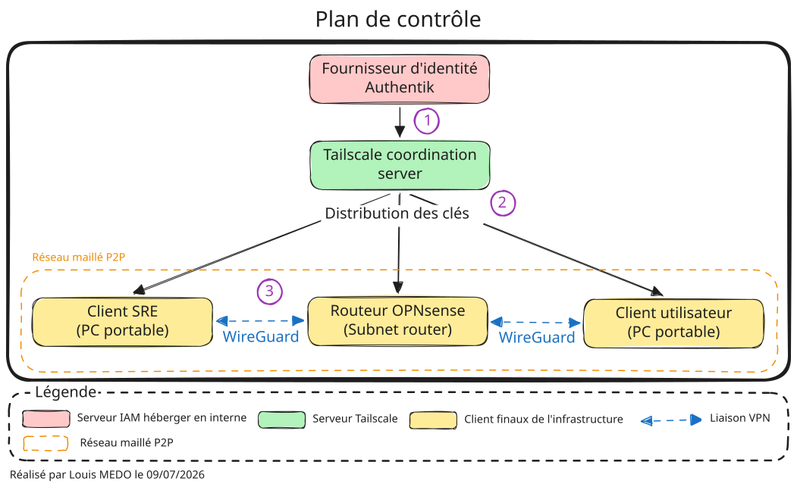
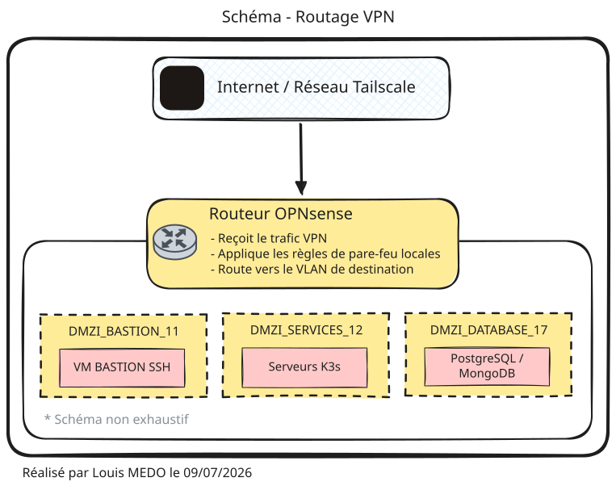
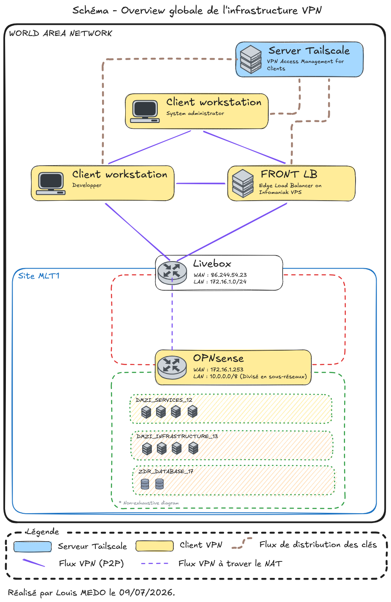

# {{ page.meta.title }}

!!! info "Informations"
    * **Date de création** : {{ page.meta.date }}
    * **Service ciblé** : {{ page.meta.service }}
    * **Auteur** : {{ page.meta.author }}
    * **Responsable** : {{ page.meta.owner }}

## 1. Objectifs de l'implémentation

L'intégration de Tailscale au sein de l'infrastructure LoutikCLOUD vise à remplacer les architectures VPN traditionnelles (en étoile) par un réseau maillé de type Zero Trust Networking Access (ZTNA). Les objectifs principaux sont :

* **Sécurité** : Chiffrement de bout en bout et abandon des mots de passe au profit d'une authentification centralisée (SSO).
* **Performance** : Routage dynamique peer-to-peer minimisant la latence.
* **Maintenabilité** : Gestion centralisée des politiques d'accès (ACLs) sous forme de code (IaC), découplée du pare-feu physique.

## 2. Architecture

Le standard ZTNA repose sur la séparation entre le plan de contrôle (qui gère l'identité et les droits) et le plan de données (qui transporte les paquets réseau).

### 2.1. Topologie Logique

**Fonctionnement :**

1. **Authentification (SSO)** : L'utilisateur (ou la machine) s'authentifie auprès du fournisseur d'identité interne (Authentik). Ce dernier valide l'identité et transmet les informations de rôles (groupes) via les claims OIDC.
2. **Distribution des clés (Control Plane)** : Le serveur de coordination Tailscale reçoit la validation, enregistre la clé publique de l'appareil, et distribue cette clé ainsi que les politiques de sécurité (ACLs) aux autres nœuds autorisés du réseau. Aucun trafic de données ne passe par ce serveur.
3. **Établissement du tunnel (Data Plane)** : Les clients (ex: PC de l'administrateur et le routeur OPNsense) utilisent les clés publiques échangées pour négocier un tunnel WireGuard direct et chiffré de bout en bout. Les communications s'effectuent en pair-à-pair (P2P).

### 2.2. Mécanismes de communication

* **Le Control Plane** : Le serveur de coordination Tailscale ne voit jamais le trafic réseau. Il agit comme un annuaire sécurisé distribuant les clés publiques WireGuard et le fichier de politique ACL à chaque nœud.
* **Le Data Plane** : Le trafic réseau est chiffré de bout en bout directement entre les nœuds via le protocole WireGuard. Les clés privées ne quittent jamais les appareils.
* **NAT Traversal** : Tailscale utilise les standards STUN/ICE pour établir des connexions directes même derrière des pare-feux stricts, et s'appuie sur des relais chiffrés (DERP) si la connexion directe UDP est bloquée.

## 3. Intégration physique

Pour éviter d'installer un agent VPN sur chaque machine virtuelle (VM) de l'infrastructure, le routeur physique OPNsense agit comme une passerelle (Subnet Router). Il fait le pont entre le réseau virtuel chiffré Tailscale (`100.x.x.x`) et les VLANs internes LoutikCLOUD.

### 3.1. Topologie de routage

Ce schéma illustre l'intégration de l'OPNsense en tant que passerelle d'accès centralisée (**Subnet Router**). Cette architecture évite d'installer un client VPN sur chaque machine virtuelle tout en garantissant un haut niveau de sécurité.

1. **Réception** : L'OPNsense capte le trafic chiffré provenant du réseau virtuel Tailscale via son interface dédiée (`tailscale0`).
2. **Filtrage (Micro-segmentation)** : Le routeur agit comme une seconde barrière de sécurité. Il évalue le trafic entrant face à ses propres règles de pare-feu locales (alias, ports stricts), validant ainsi la politique de défense en profondeur de l'infrastructure.
3. **Distribution** : Si le flux est légitime, l'OPNsense le route de manière isolée vers le VLAN de destination correspondant (Bastion, Services ou Base de données).

## 4. Gestion des identités

L'infrastructure applique le principe du moindre privilège avec une approche de blocage par défaut (*Default Deny*). Les entités sont classées en deux catégories :

**Identités humaines (Identifié sous forme de groupes)** : Les utilisateurs s'authentifient via Authentik (en OIDC). Tailscale récupère les rôles sous forme de groupes (Via les claim Authentik).

  * `group:management` : Équipe d'administration SRE (accès étendu).
  * `group:user` : Utilisateurs standards (accès restreint aux portails web).

**Identités machines (Identifié sous forme de tags)** : Les serveurs d'infrastructure sont détachés des comptes utilisateurs et reçoivent un tag d'identification.

  * `tag:s2s` : Loadbalancer de bordure (en contact direct avec Internet).

## 5. Matrice des ACL Tailscale

La gestion des accès est traitée sous forme de code (Infrastructure as Code). Le fichier `acl.json` centralise les droits d'accès au niveau macro et est strictement versionné sur le dépôt Git **[https://github.com/loutik/infrastructure-vpn](https://github.com/loutik/infrastructure-vpn)**. Toute modification doit faire l'objet d'un commit avant d'être appliquée en production. 

Les politiques ACL sont évaluées et appliquées directement par le filtre de paquets de chaque nœud :

| Identité Source | Zone de destination (CIDR) | Ports | Description du flux |
| :--- | :--- | :--- | :--- |
| **`group:management`** | `DMZE_BASTION_11` | `*` | Administration : Accès au Bastion de rebond. |
| **`group:management`** | `DMZI_SERVICES_12` | `*` | Administration : Accès à la zone des services (ex: K3s). |
| **`group:management`** | `DMZI_INFRASTRUCTURE_13` | `*` | Administration : Accès aux fondations (DNS, IPAM). |
| **`group:management`** | `DMZI_SUPERVISION_14` | `*` | Administration : Accès aux outils de métrologie. |
| **`group:management`** | `DMZI_DEPLOYMENT_15` | `*` | Administration : Accès à la chaîne CI/CD. |
| **`group:management`** | `DMZI_BACKUP_16` | `*` | Administration : Accès au serveur de sauvegardes. |
| **`group:management`** | `DMZI_PROXY_23` | `*` | Administration : Accès au Reverse Proxy de bordure. |
| **`group:management`** | `ZDR_DATABASE_17` | `*` | Administration : Accès direct aux bases de données. |
| **`group:management`** | `LAN_ADMOOB_20` | `*` | Administration : Accès au réseau matériel OOB. |
| **`group:user`** | `DMZI_INFRASTRUCTURE_13` | `53` | Utilisateurs : Résolution DNS interne (Pi-hole/Bind). |
| **`group:user`** | `DMZI_PROXY_23` | `80, 443` | Utilisateurs : Accès web aux applications via le proxy. |
| **`tag:s2s`** | `DMZI_SERVICES_12` | `80, 443` | Machines (LB) : Flux inter-site pour le routage HTTP/S. |

## 6. Annexes

**Fonctionnement général dans l'environnement LoutikCLOUD :**

L'architecture s'appuie sur Tailscale pour créer un réseau privé de bout en bout (WAN) au-dessus d'infrastructures physiques hétérogènes (Domicile, Cloud public, Réseaux mobiles).

1. **Le rôle central du routeur OPNsense** : Situé sur le site `MLT1`, le pare-feu OPNsense ne se contente pas de protéger le réseau physique local. Il intègre le client Tailscale et opère en tant que *Subnet Router*. Son rôle est de capter le trafic encapsulé provenant des postes distants (via la Livebox qui effectue un simple passage de flux grâce au NAT Traversal), de le déchiffrer, puis d'appliquer les règles strictes de micro-segmentation inter-VLANs avant d'atteindre les zones DMZ ou ZDR.
2. **Gestion des accès externes (Edge Load Balancer)** : Le VPS hébergé chez Infomaniak agit comme point d'entrée public (FRONT LB). Au lieu d'ouvrir des ports risqués sur la box Internet du domicile, ce VPS est équipé de Tailscale et possède l'identité `tag:s2s`. Il réceptionne les requêtes web publiques et les achemine de manière sécurisée et chiffrée vers les services internes (VLAN 12) au travers du tunnel VPN.
3. **Sécurisation des terminaux** : Les postes de travail des administrateurs et développeurs exécutent le client Tailscale localement. Le routage dynamique permet aux appareils de communiquer directement avec l'OPNsense (ou entre eux si nécessaire) via le chemin le plus court, garantissant une latence minimale tout en respectant les restrictions définies par les ACLs.