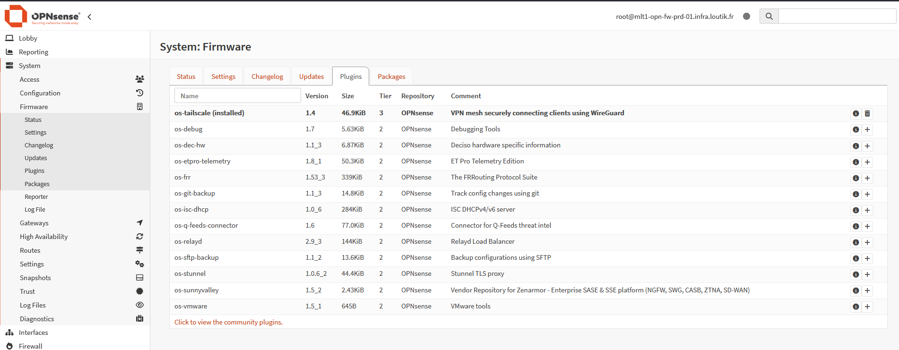
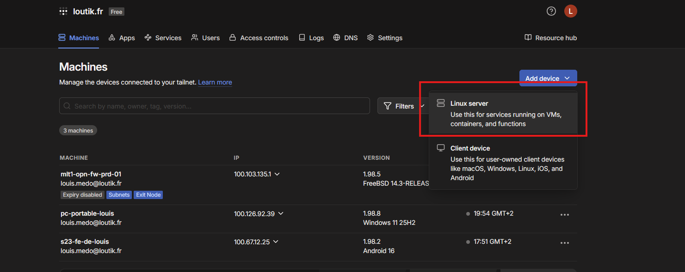
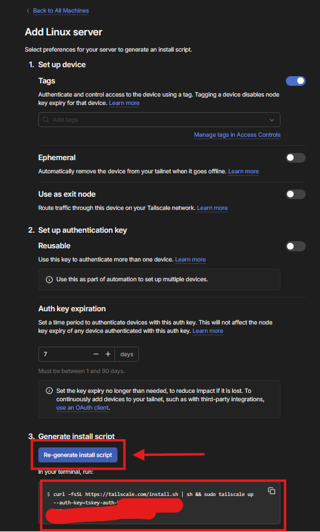
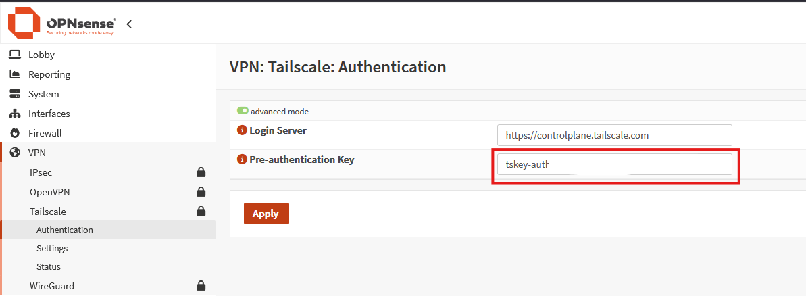
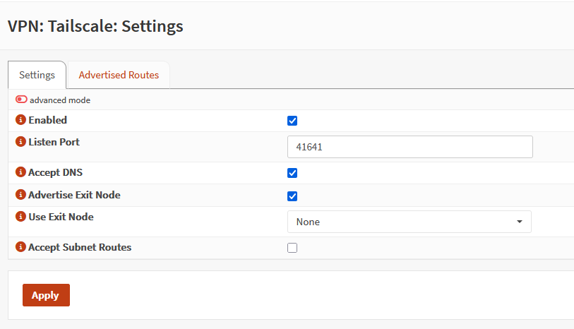
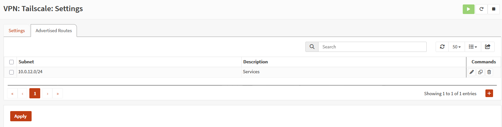
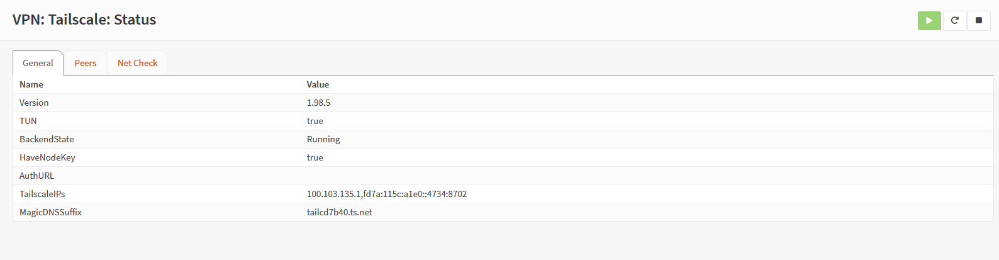

# {{ page.meta.title }}

!!! info "Informations"
    * **Date de création** : {{ page.meta.date }}
    * **Service ciblé** : {{ page.meta.service }}
    * **Auteur** : {{ page.meta.author }}
    * **Responsable** : {{ page.meta.owner }}

## 1. Contexte

Ce composant installe l'agent officiel Tailscale directement sur le système d'exploitation du routeur de bordure OPNsense (`mlt1-opn-fw-prd-01`). Au sein de l'infrastructure LoutikCLOUD, ce service ne s'intègre pas comme un simple client isolé, mais comme un **Subnet Router**.

Il a pour dépendance directe l'Identity Provider (IdP) Authentik pour la gestion des authentifications utilisateurs via OIDC. Le routeur intercepte le trafic provenant du WAN virtuel Tailscale et assure la passerelle en acheminant les paquets vers les différents réseaux locaux logiques de l'infrastructure (DMZ Services, DMZ Infrastructure et ZDR Database) en fonction des politiques d'accès centrales (ACLs) appliquées à chaque nœud.

## 2. Prérequis

* **Ressources d'infrastructure** : Un routeur physique ou virtuel OPNsense opérationnel disposant d'un accès à Internet.
* **Réseau** : Le plan d'adressage local (`10.0.0.0/8`) doit être correctement segmenté en sous-réseaux logiques (VLANs). Les ports UDP requis pour le protocole de communication WireGuard et la négociation NAT (STUN/ICE) doivent être autorisés en sortie.
* **Gestion des accès et secrets** : Un compte d'administration sur la console d'administration centrale web Tailscale afin de générer le jeton d'enregistrement éphémère (*Auth Key*).

## 3. Installation et configuration du Subnet Router

### 3.1. Installation du plugin Tailscale sur OPNsense

L'installation s'effectue via le gestionnaire de paquets natif d'OPNsense pour garantir le suivi des mises à jour système.

1. Naviguez dans **System > Firmware > Plugins**.
2. Recherchez le paquet `os-tailscale`.
3. Procédez à l'installation. Une fois terminé, le plugin doit apparaître avec la mention `(installed)`.

  

### 3.2. Création du token d'authentification sur la console Tailscale

Afin d'intégrer le routeur de manière autonome sans le lier directement à un compte utilisateur interactif, une clé d'authentification (*Auth Key*) est requise.

1. Connectez-vous à la console d'administration Tailscale.
2. Dans l'onglet **Machines**, cliquez sur **Add device** et sélectionnez **Linux server**.

  

3. Définissez les paramètres de la clé d'authentification (expiration, réutilisabilité).
4. Cliquez sur **Generate install script** (ou **Generate auth key**) et copiez la clé générée, qui commence par `tskey-auth-`.

  

### 3.3. Authentification du nœud sur OPNsense

L'intégration au Tailnet s'effectue en déclarant le jeton précédemment généré dans la configuration du plugin.

1. Sur l'interface OPNsense, naviguez dans **VPN > Tailscale > Authentication**.
2. Collez la clé dans le champ **Pre-authentication Key**.
3. Cliquez sur **Apply**.

  

### 3.4. Configuration générale du service Tailscale

L'activation du démon et la configuration des paramètres d'écoute se font dans les paramètres généraux.

1. Naviguez dans **VPN > Tailscale > Settings**, onglet **Settings**.
2. Cochez la case **Enabled** pour activer le service.
3. Vérifiez le **Listen Port** (par défaut `41641`).
4. Activez **Accept DNS** et **Advertise Exit Node** si l'infrastructure requiert l'utilisation d'un DNS interne ou d'un routage de sortie global.
5. Cliquez sur **Apply**.

  

### 3.5. Déclaration des routes d'infrastructure

C'est cette étape qui transforme l'OPNsense en passerelle pour l'infrastructure LoutikCLOUD en annonçant les VLANs internes au reste du Tailnet.

1. Toujours dans **VPN > Tailscale > Settings**, basculez sur l'onglet **Advertised Routes**.
2. Cliquez sur le bouton d'ajout **(+)** pour déclarer un nouveau réseau.
3. Renseignez le **Subnet** (ex: `10.0.12.0/24`) et une **Description** explicite (ex: `Services`).
4. Cliquez sur **Apply**.

  

!!! warning "Sécurité"
    Par sécurité, Tailscale n'accepte pas automatiquement les nouvelles routes. Il est impératif de retourner sur la console web Tailscale, de sélectionner la machine OPNsense, et d'approuver (*Approve*) explicitement les sous-réseaux annoncés.

### 3.6. Vérification du statut de connexion

Il est nécessaire de valider que le tunnel WireGuard est correctement monté et que le plan de contrôle répond.

1. Naviguez dans **VPN > Tailscale > Status**.
2. Vérifiez que la valeur **BackendState** est définie sur `Running`.
3. Confirmez l'obtention d'une adresse IP virtuelle dans la section **TailscaleIPs** (ex: `100.103.135.1`).

  

---

## Annexe

* [Infrastructure VPN LoutikCLOUD](../infrastructure-vpn-tailscale.md)
* [Gestion de la configuration ACL Tailscale (GitHub)](https://github.com/loutik/infrastructure-vpn)