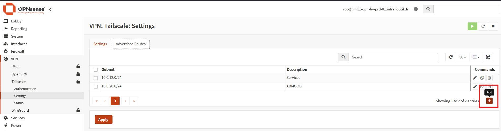
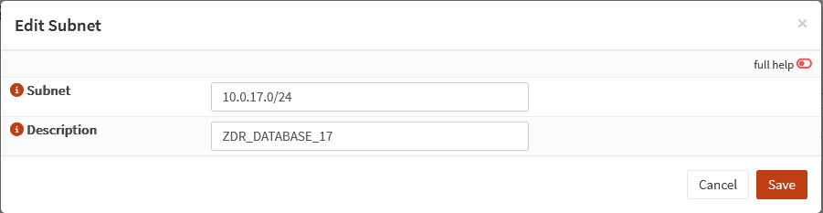
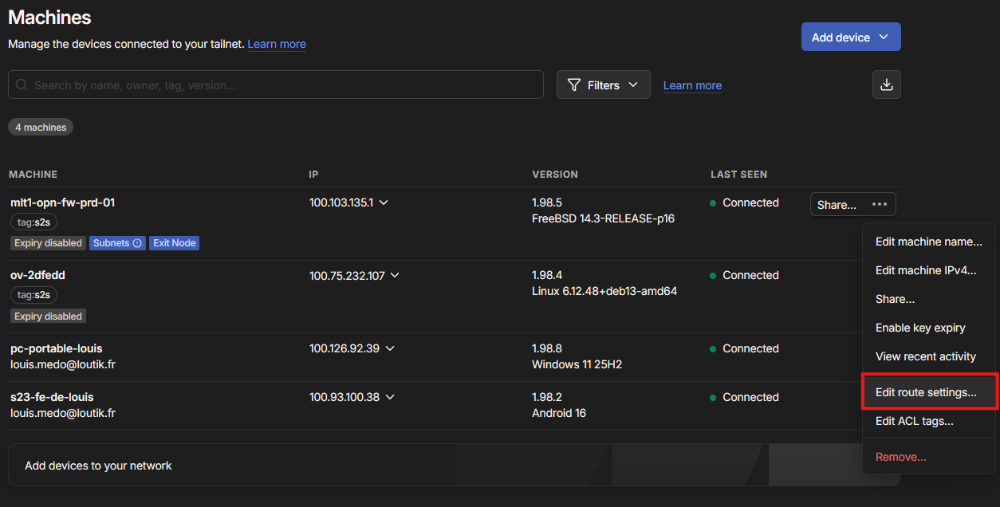
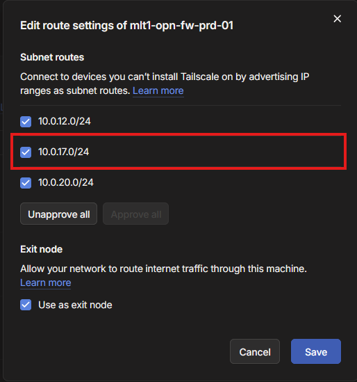

# {{ page.meta.title }}


!!! info "Informations"

    * **Date de mise à jour** : {{ page.meta.date }}
    * **Service ciblé** : {{ page.meta.service }}
    * **Auteur** : {{ page.meta.author }}
    * **Responsable** : {{ page.meta.owner }}

## 1. Contexte

Ce runbook définit la procédure d'exploitation standard pour annoncer et router un nouveau sous-réseau (VLAN) physique ou virtuel au sein du réseau maillé Tailscale via la passerelle OPNsense. Cette procédure doit être exécutée lors de l'extension de l'infrastructure réseau (ex: création d'une nouvelle zone DMZ ou ZDR) nécessitant un accès distant sécurisé.

## 2. Prérequis

* Accès administrateur à l'interface web du pare-feu OPNsense (`mlt1-opn-fw-prd-01`).
* Accès administrateur à la console web globale Tailscale (tenant `loutik.fr`).
* Les informations du réseau à ajouter (CIDR, ex: `10.0.17.0/24`) et sa description.
* Accès au dépôt GitOps de l'infrastructure VPN pour la modification des règles d'accès.

## 3. Procédure d'exécution

1. **Déclaration du sous-réseau sur OPNsense.** Connectez-vous à l'OPNsense. Naviguez dans **VPN > Tailscale > Settings**, puis accédez à l'onglet **Advertised Routes**. Cliquez sur le bouton d'ajout **(+)**.

    

    Renseignez le bloc CIDR exact dans le champ **Subnet** et une description fonctionnelle respectant la nomenclature (ex: `ZDR_DATABASE_17`). Sauvegardez puis validez les changements dans l'interface principale.

    

2. **Approbation du routage sur la console Tailscale.** Connectez-vous à la [console Tailscale](https://login.tailscale.com/login). Dans la section **Machines**, localisez le routeur `mlt1-opn-fw-prd-01`. Cliquez sur le menu contextuel `...` et sélectionnez "**Edit route settings...**".

    

    Dans la section **Subnet routes**, cochez la case correspondant au nouveau sous-réseau (ex: `10.0.17.0/24`) pour l'approuver formellement au sein du plan de contrôle, puis sauvegardez.

    

3. **Autorisation du trafic via les ACLs Tailscale.** L'ajout de la route ne permet pas le transit des données en raison du *Default Deny* du réseau. Vous devez éditer le fichier `acl.json` pour autoriser les flux vers cette nouvelle zone (se référer au runbook dédié à la gestion des ACLs : [Gestion ACL Tailscale](./gestion-acl-tailscale.md)). Une fois le fichier modifié, poussez les changements sur le dépôt.

    ```bash
    git add acl.json
    git commit -m "feat(network): ajout et autorisation du sous-reseau 10.0.17.0/24"
    git push origin main
    ```

## 4. Validation

Pour valider le bon déploiement de la configuration, effectuez les vérifications suivantes depuis un poste client connecté au Tailnet et possédant les droits d'accès définis dans les ACLs :

1. Vérifier que la nouvelle route est bien reçue par le client Tailscale :
   ```bash
   tailscale status
   ```

2. Effectuer un test de connectivité réseau (ICMP) vers une IP du nouveau sous-réseau (si le pare-feu local l'autorise) :
   ```bash
   ping 10.0.17.1
   ```

3. Vérifier les journaux du pare-feu OPNsense (interface `tailscale0`) pour s'assurer que les paquets atteignent bien la passerelle et sont routés sans être bloqués par une règle de micro-segmentation imprévue.