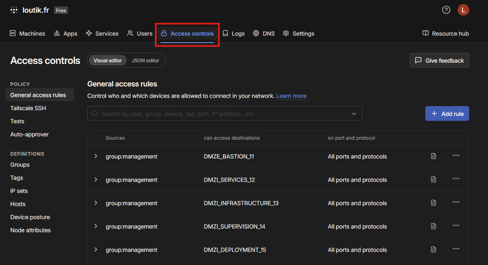
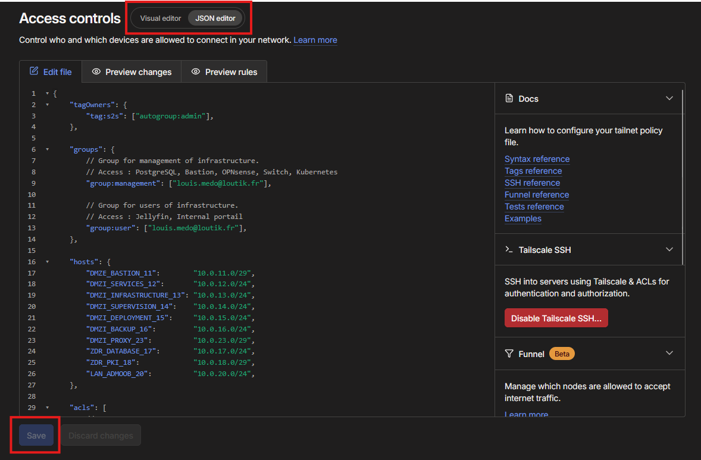

# {{ page.meta.title }}


!!! info "Informations"

    * **Date de mise à jour** : {{ page.meta.date }}
    * **Service ciblé** : {{ page.meta.service }}
    * **Auteur** : {{ page.meta.author }}
    * **Responsable** : {{ page.meta.owner }}

## 1. Contexte

Ce runbook définit la procédure opérationnelle standard (SOP) pour modifier les règles de filtrage réseau (ACLs) du VPN Tailscale. Il explique comment déclarer de nouveaux groupes d'utilisateurs, assigner des tags d'infrastructure, et autoriser le trafic entre ces entités. La gestion s'effectue selon le principe du GitOps (Infrastructure as Code) via un dépôt centralisé, bien que le déploiement sur la console Tailscale reste une action manuelle.

## 2. Prérequis

* Un accès Git au dépôt `loutik/infrastructure-vpn`.
* Un éditeur de texte ou un IDE (ex: VS Code) pour modifier le fichier JSON.
* Un accès avec privilèges d'administration à la console web Tailscale (`loutik.fr`).

## 3. Procédure d'exécution

1. **Cloner le dépôt de configuration localement** :

    Assurez-vous de travailler sur la dernière version de la configuration.

    ```bash
    git clone git@github.com:loutik/infrastructure-vpn.git
    cd infrastructure-vpn
    ```

    - **`git clone`** : Télécharge le dépôt distant en local pour édition.

2. **Ajouter un tag d'infrastructure (Identité Machine)** :

    Si vous devez autoriser un nouveau type de machine (ex: un serveur de supervision), ouvrez le fichier `acl.json` et ajoutez le tag dans le bloc `tagOwners`. Vous devez définir quel groupe (ou `autogroup:admin`) a le droit d'assigner ce tag.

    ```json
    "tagOwners": {
        "tag:s2s":         ["autogroup:admin"],
        "tag:supervision": ["autogroup:admin"]
    },
    ```

3. **Ajouter un groupe d'utilisateurs (Identité Humaine)** :

    Si vous devez accorder des droits à un nouveau groupe issu de votre SSO Authentik, déclarez-le dans le bloc `groups` en y ajoutant les adresses e-mails correspondantes.

    ```json
    "groups": {
        "group:management": ["louis.medo@loutik.fr"],
        "group:dev":        ["developpeur@loutik.fr"]
    },
    ```

4. **Définir une règle de filtrage (ACL)** :

    Dans le bloc `acls`, ajoutez une nouvelle règle JSON. Vous devez spécifier l'action (`accept`), la source (`src`) et la destination (`dst`). Utilisez les alias de réseau définis dans le bloc `hosts` si nécessaire.

    ```json
    "acls": [
        // Règle autorisant le groupe dev à accéder à un serveur taggé sur le port 8080
        { "action": "accept", "src": ["group:dev"], "dst": ["tag:supervision:8080"] },
        // Règle autorisant un tag à accéder à un VLAN spécifique sur tous les ports
        { "action": "accept", "src": ["tag:supervision"], "dst": ["DMZI_SERVICES_12:*"] }
    ],
    ```

5. **Historiser la modification (GitOps)** :

    Sauvegardez le fichier `acl.json` et poussez les modifications sur le dépôt pour conserver un historique d'audit.

    ```bash
    git add acl.json
    git commit -m "feat(acl): ajout des regles d'acces pour le groupe dev et le tag supervision"
    git push origin main
    ```

6. **Appliquer la configuration en production** :

    Actuellement, le déploiement n'est pas automatisé (CI/CD). Vous devez appliquer le fichier manuellement sur la console Tailscale. Copiez l'intégralité du contenu de votre fichier `acl.json` local. Connectez-vous à la console Tailscale et rendez-vous dans l'onglet **Access controls**.

    

    Basculez sur l'éditeur de code en sélectionnant **JSON editor**, collez le nouveau contenu, puis cliquez sur le bouton **Save**.

    

## 4. Validation
Pour valider l'application correcte des nouvelles politiques d'accès :

1.  Dans l'interface web Tailscale, restez dans la section **Access controls**.
2.  Assurez-vous qu'aucun message d'erreur de syntaxe JSON n'est affiché.
3.  Effectuez un test de connexion direct : demandez à un utilisateur du groupe nouvellement configuré (ou connectez-vous avec l'identité du tag) de tenter d'accéder à la ressource autorisée (ex: requête HTTP, Ping).
4.  Vérifiez que les accès aux ressources non mentionnées dans la nouvelle règle restent bloqués (Default Deny).