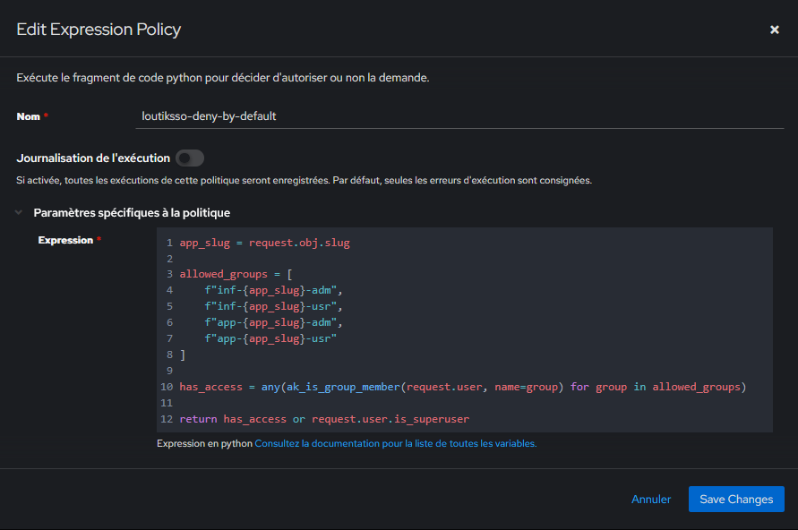

# {{ page.meta.title }}


!!! info "Informations"
    * **Date de création** : {{ page.meta.date }}
    * **Service ciblé** : {{ page.meta.service }}
    * **Auteur** : {{ page.meta.author }}
    * **Responsable** : {{ page.meta.owner }}

## 1. Architecture et contexte
Cette procédure déploie une "Dynamic Flow Policy" agissant comme un point de contrôle centralisé sur l'ensemble de l'infrastructure LoutikCLOUD. Ce composant applique un modèle de sécurité "Deny by default" global : il intercepte le flux d'autorisation (Authorization Flow) d'Authentik avant la redirection vers les services (ex: Proxmox). En analysant dynamiquement le "slug" de l'application ciblée, la politique valide l'appartenance de l'utilisateur aux groupes adéquats définis par la norme de nommage [REF-005](../../../01-architecture/referentiels/ref-005-convention-nommage-authentik.md), bloquant nativement tout accès non explicitement autorisé.

## 2. Prérequis

* Accès administrateur (Superuser) à la console de gestion Web d'Authentik.
* Un flux d'autorisation existant, configuré et utilisé par les applications (ex: `default-provider-authorization-implicit-consent`).
* Applications cibles et groupes d'utilisateurs strictement nommés selon les conventions d'infrastructure LoutikCLOUD (norme REF-005).

## 3. Configuration de la stratégie d'accès

3.1. **Création de la politique d'évaluation (Expression Policy).** Dans l'interface Authentik, naviguer vers `Customization` > `Policies` > `New Policy` > `Expression Policy` et créer une nouvelle politique nommée "loutiksso-deny-by-default" en y intégrant le code d'évaluation.

  

  ```python
  app_slug = request.context["application"].slug
  allowed_groups = [
      f"inf-{app_slug}-adm",
      f"inf-{app_slug}-usr",
      f"app-{app_slug}-adm",
      f"app-{app_slug}-usr"
  ]
  has_access = any(ak_is_group_member(request.user, name=group) for group in allowed_groups)
  return has_access or request.user.is_superuser
  ```

  * `request.context["application"].slug` : Propriété extrayant l'identifiant court (slug) de l'application ciblée par la tentative de connexion au moment de la requête.
  * `allowed_groups` : Liste (tableau) générant dynamiquement les combinaisons de groupes valides selon la norme REF-005 pour l'application en cours de demande.
  * `any(...)` : Fonction native Python qui itère sur la liste de manière optimisée et retourne `True` dès que la première condition d'appartenance à un groupe est validée.
  * `ak_is_group_member(...)` : Fonction de l'API interne Authentik évaluant de manière booléenne si l'utilisateur possède le groupe calculé.
  * `request.user.is_superuser` : Attribut de l'objet utilisateur agissant comme mécanisme "Break-glass" pour garantir que le compte administrateur global ne subisse jamais de blocage.

!!! warning "Application de la règle"
    Pour appliquer la règle vous devez ajouter cette policie à l'application sur Authentik. Se référer à cette procédure : 