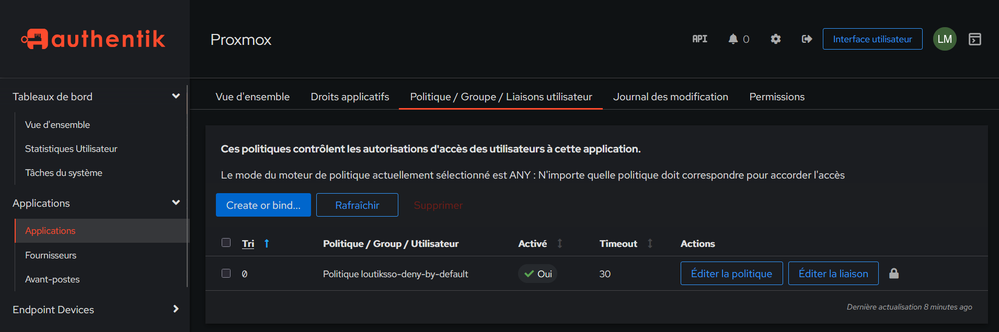

# {{ page.meta.title }}


!!! info "Informations"

    * **Date de mise à jour** : {{ page.meta.date }}
    * **Service ciblé** : {{ page.meta.service }}
    * **Auteur** : {{ page.meta.author }}
    * **Responsable** : {{ page.meta.owner }}

## 1. Contexte et Objectif

Ce runbook détaille la procédure opérationnelle pour lier la politique d'expression globale (`loutiksso-deny-by-default`) directement à une application cible dans Authentik. Cette action doit être exécutée à chaque intégration d'un nouveau service (ex: Proxmox) afin d'appliquer le modèle de sécurité "Deny by Default". Elle garantit que seuls les utilisateurs appartenant aux groupes dynamiques spécifiés par la norme REF-005 peuvent accéder au service.

## 2. Prérequis

* Accès administrateur (Superuser) actif sur la console d'administration Web Authentik.
* Politique d'expression `loutiksso-deny-by-default` préalablement créée et fonctionnelle.
* Application cible (ex: Proxmox) déjà configurée dans le répertoire des applications.

## 3. Procédure d'exécution

1. **Accès au menu de liaison de l'application.** Naviguer dans l'interface d'administration pour cibler les paramètres de sécurité spécifiques de l'application.

  ```text
  Applications > Applications > [Sélectionner l'application] > Politique / Groupe / Liaisons utilisateur
  ```

  - **`[Sélectionner l'application]`** : Clic sur l'application concernée (ex: Proxmox) pour ouvrir sa vue détaillée.


2. **Attachement de la politique de restriction.** Lier la politique existante chargée d'évaluer les droits d'accès au niveau de l'application.

  ```text
  Create or bind... > Lier une politique existante > Cible: loutiksso-deny-by-default > Ordre: 0
  ```

  - **`Cible: loutiksso-deny-by-default`** : Sélectionne la politique contenant le script Python d'évaluation.
  - **`Ordre: 0`** : Assigne la priorité la plus haute pour s'assurer que cette règle est évaluée en premier.

## 4. Validation



1. Vérifier visuellement dans l'onglet **Politique / Groupe / Liaisons utilisateur** de l'application que la ligne contenant `Politique loutiksso-deny-by-default` est présente et que la colonne **Activé** indique `Oui`.
2. Effectuer un test de connexion avec un compte utilisateur ne possédant pas les groupes requis (ex: `inf-[slug]-adm` ou `inf-[slug]-usr`) : l'accès doit renvoyer une erreur d'autorisation explicite (Accès refusé).
3. Effectuer un test de connexion avec un compte utilisateur possédant le groupe adéquat : la redirection vers le service (ex: l'interface Proxmox) doit aboutir avec succès.