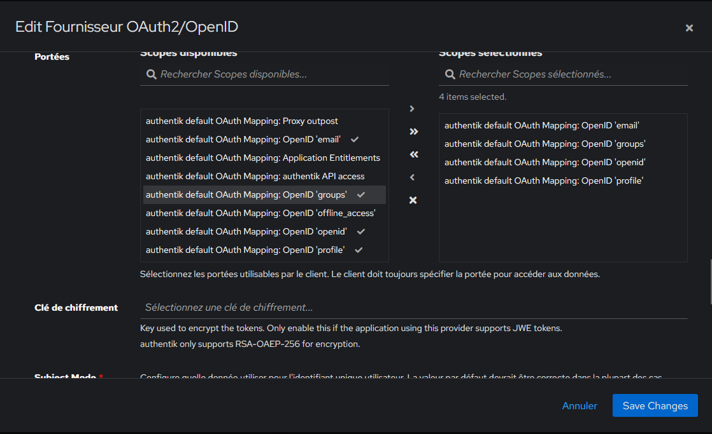

# {{ page.meta.title }}


!!! info "Informations"

    * **Date de mise à jour** : {{ page.meta.date }}
    * **Service ciblé** : {{ page.meta.service }}
    * **Auteur** : {{ page.meta.author }}
    * **Responsable** : {{ page.meta.owner }}

## 1. Contexte

L'objectif de cette procédure est de configurer le mappage de portée (Scope Mapping) personnalisé et de l'associer à un fournisseur OIDC (Provider) dans Authentik. Cette opération doit être effectuée lors de l'intégration d'un nouveau service nécessitant la transmission dynamique des groupes de l'utilisateur via le jeton d'authentification pour gérer les habilitations (RBAC).

## 2. Prérequis

* Accès administrateur (Superuser) actif sur la console d'administration Web Authentik.
* Fournisseur OIDC (Provider) de l'application cible préalablement configuré.

## 3. Procédure d'exécution

1. **Configuration du Fournisseur OIDC (Provider).** Naviguer dans **Applications > Providers** et éditer le Provider OIDC cible. Dérouler la section **Paramètres avancés du protocole** pour ajouter la portée au jeton.

  

  ```text
  Sélectionner : authentik default OAuth Mapping: OpenID 'groups'
  ```

  - **`Scopes sélectionnés`** : Autorise le fournisseur à injecter de manière dynamique le claim JSON `"groups"` dans le token OIDC transmis à l'application.